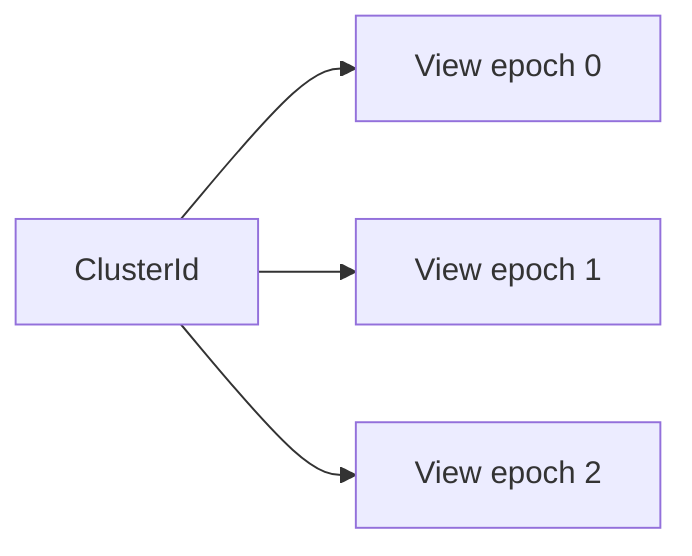
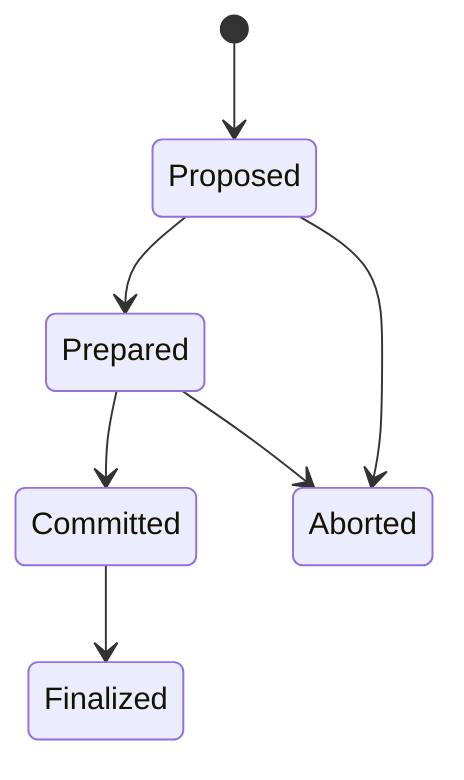

# Cluster Views and Topology Operations

Mantissa can split one cluster lineage into multiple active views and later
merge views back together. The implementation is intentionally simple and
durable: every node has one active view, topology operations are stored as
durable records, and startup replay resumes any non-finalized operation.

## Core Terms

### `ClusterId`

The long-lived lineage identifier.

### `ClusterViewId`

One concrete control-plane view inside that lineage, represented as:

- `cluster_id`
- `epoch`

In CLI output this appears as `CLUSTER_UUID@EPOCH`.

## Mental Model

At runtime, a node acts inside exactly one active `ClusterViewId`.

- gossip and full anti-entropy stay scoped to that active view,
- cluster operations change which view the node considers active,
- split operations also define which peers stay in-scope for the new view.



For replication behavior across those boundaries, see
`docs/cluster_view_gossip_sync.md`.

## CLI Surface

Current cluster commands are:

- `mantissa clusters list`
- `mantissa clusters name <cluster-id> <name>`
- `mantissa clusters merge <source-cluster-id> <destination-cluster-id> [--dry-run] [--services rebalance|preserve] [--depends-on <operation-id>]...`
- `mantissa clusters split --cluster <cluster-id> --by gpu-vendor --values NVIDIA,AMD`
- `mantissa clusters split --interactive --left-name blue --right-name green`

`clusters list` shows known lineages, their latest visible epoch, and whether
the listed view is active on the local node.

## Durable Operation Model

Merge and split both persist a `ClusterOperationRecord` containing:

- operation id,
- kind (`Merge` or `Split`),
- stage,
- source view list,
- target view list,
- policy choices,
- human-readable details,
- split assignments when applicable.

A merge has no dependencies unless `--depends-on` is supplied. Use the flag
once for every unfinished operation that changes the merge's source or
destination cluster. The new merge waits for all listed operations to finalize.
If one of them aborts, the new merge also aborts. This gives every node the same
order when several merges are submitted at nearly the same time.

For example, if operations `OP_A` and `OP_B` build the two clusters consumed by
the next merge:

```sh
mantissa clusters merge <source-cluster-id> <destination-cluster-id> \
  --depends-on OP_A \
  --depends-on OP_B
```

Operation records live in:

- `src/topology/operation.rs`
- `src/store/cluster_operation_store.rs`

## Operation Lifecycle

The current implementation advances through a compact stage machine:

1. `Proposed`
2. `Prepared`
3. `Committed`
4. `Finalized`

If commit preconditions no longer match local state, the operation is marked
`Aborted`.

These stages are local crash-recovery bookkeeping, not acknowledgements from
other nodes and not a distributed commit barrier. The operation's source,
targets, assignments, and policies are immutable intent. Any node that sees
that intent applies its own assignment idempotently and an offline node does
not block other participants: it applies the same intent when it returns.

The requester persists transition key material before new intent whenever it
can author that material. It then gossips only an availability hint. Receivers
pull the authoritative operation and key rows through the cluster-wide MST
Sync domains. Startup replay re-runs local unfinished work, so neither a crash
nor a missed gossip message strands the topology change.



The stage advancement code lives in:

- `src/topology/cluster_operations/progress.rs`

## Split Behavior

### Source View

The source view for a split must equal the local node's active view. Mantissa
does not start a split from a stale or purely remote view.

### Target Views

Split targets are named. Target `ClusterViewId` values are derived
deterministically from:

- the source lineage,
- the source epoch,
- the target name.

That keeps different nodes from inventing different target view ids for the
same split request.

### Selection Modes

The CLI supports:

- explicit interactive left/right assignment,
- filter-driven splits by resource fields such as GPU vendor, GPU model, CPU
  vendor, CPU brand, GPU count, CPU cores, CPU logical count, or total memory.

### Split Policies

Split stores both a service policy and a network policy.

Service policy:

- `partitioned`: prune out-of-scope task runtime rows so each resulting view
  keeps only the work assigned to it.
- `preserve`: keep service and task runtime rows as-is.

Network policy:

- `isolate`: prune out-of-scope network peer and attachment rows so overlays
  become partition-local.
- `preserve`: keep network runtime rows as-is.

### Split Commit Effects

When a split commits locally, Mantissa:

1. installs the deterministic key for the assigned target view,
2. computes and persists the local target view,
3. excludes evicted peers from normal scoped loops while retaining credentials
   for cluster-wide repair,
4. optionally prunes task runtime rows,
5. optionally prunes network runtime rows.

## Merge Behavior

### Preconditions

A merge request must involve the local active view. Mantissa will not relay a
merge between two entirely remote views from an arbitrary third node.

### Merge Policy

The current merge policy only affects services:

- `rebalance`: nudge running services so reconciliation can rebalance replicas
  across the merged view.
- `preserve`: keep current service placement without extra merge-time nudges.

### Merge Commit Effects

When a merge commits locally, Mantissa:

1. imports and activates the destination master key, deferring local apply if
   its encrypted grant has not converged yet,
2. switches the local active view to the destination view,
3. clears any split-era excluded peer set,
4. optionally nudges services for post-merge rebalance.

No timeout changes an accepted merge into failure. Missing grants or an
offline destination are transient convergence conditions. Later cluster-wide
Sync retries the same durable intent. Existing grant rows identify nodes that
already hold each key and the lowest live holder republishes missing merge grants,
so an offline original issuer does not become a completion barrier.

## Transition Participants

Commit-time side effects are organized as transition participants. Today that
includes:

- split peer-scope updates,
- split task runtime pruning,
- split network runtime pruning,
- merge-time service rebalance nudges.

Relevant code:

- `src/cluster/coordinator.rs`
- `src/cluster/participant.rs`
- `src/cluster/transition.rs`
- `src/topology/service.rs`

## Operational Restrictions

Mantissa blocks many mutating actions while a non-dry-run topology operation is
still active. That currently includes:

- starting or stopping tasks,
- deploying or deleting services,
- submitting, cancelling, or deleting jobs,
- submitting agent sessions or agent input,
- creating or deleting networks,
- creating, importing, or deleting volumes,
- mutating secrets,
- starting another merge or split.

Peer joins are also rejected during active split operations so assignments do
not become ambiguous mid-transition.

## Startup Recovery

Startup performs three recovery steps:

1. restore cluster lineage names from durable operation history,
2. replay any non-finalized cluster operations,
3. restore split peer scope from durable history.

That means a node restart should come back with the same active view and peer
scope that the durable topology history implies.

## Master-Key Retention and GC

Master-key deletion uses a convergent frontier rather than operation
acknowledgements:

1. the retired view must be durably visible,
2. the `Peers`, `ClusterViews`, and `SecretMasterKeys` roots must match every known
   cluster-wide peer,
3. only one non-retired master-key current scope may remain, so split partitions
   cannot infer global secret references from their local view,
4. the merged local view's `Secrets` root must match its active-view peers,
5. no visible secret may reference the key,
6. the retirement/key snapshot must remain locally observed for the configured
   retention window.

Restarting forgets the in-memory observation time and therefore extends
retention conservatively. Local wrapped key envelopes are retained, so a node
that was offline keeps its source key until it applies the transition. Terminal
operation intent is retained longer than the key cleanup window so late nodes
can still repair from the operation MST. Older terminal intents are compacted
only after the `Peers`, `ClusterViews`, `SecretMasterKeys`, and
`ClusterOperations` roots match every known cluster-wide peer. This frontier
proves the repair intent and its prerequisites have spread before deletion.
It is not an operation-completion acknowledgement.

## Code Map

- `src/cluster/view.rs`
- `src/topology/operation.rs`
- `src/topology/operation_rpc.rs`
- `src/topology/cluster_operations/progress.rs`
- `src/topology/service.rs`
- `crates/mantissa-client/src/clusters/*.rs`

## Related Documents

- `docs/cluster_view_gossip_sync.md`
- `docs/data-replication.md`
