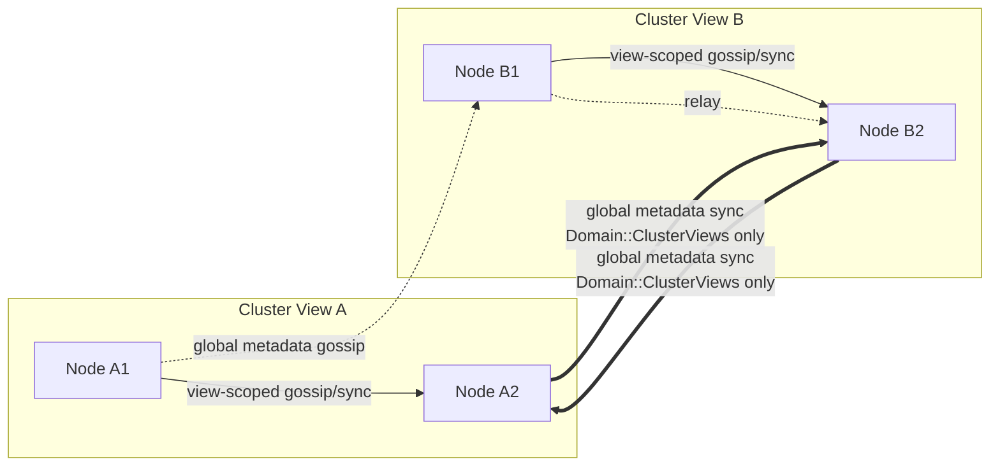
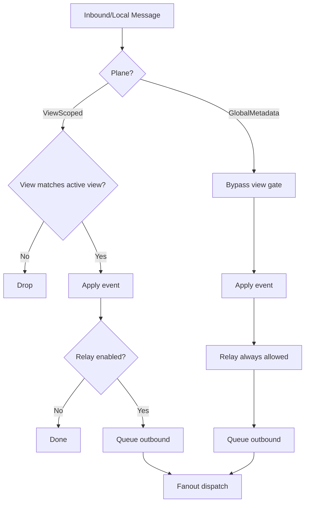
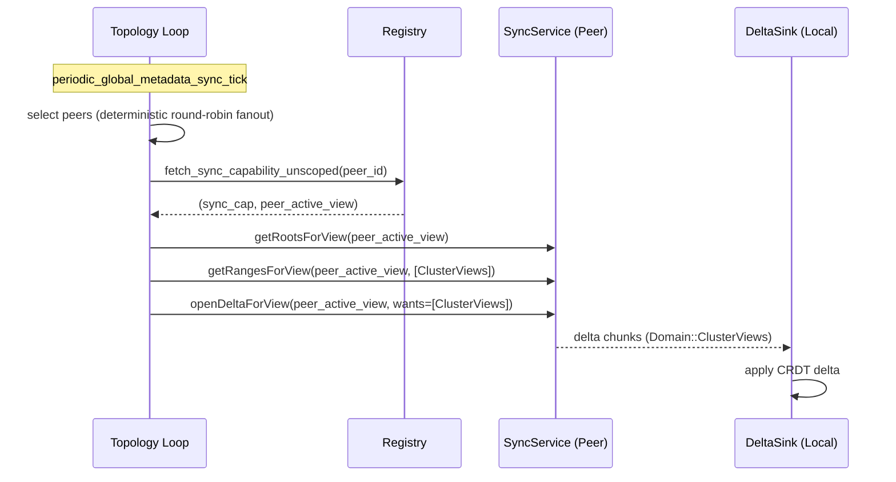
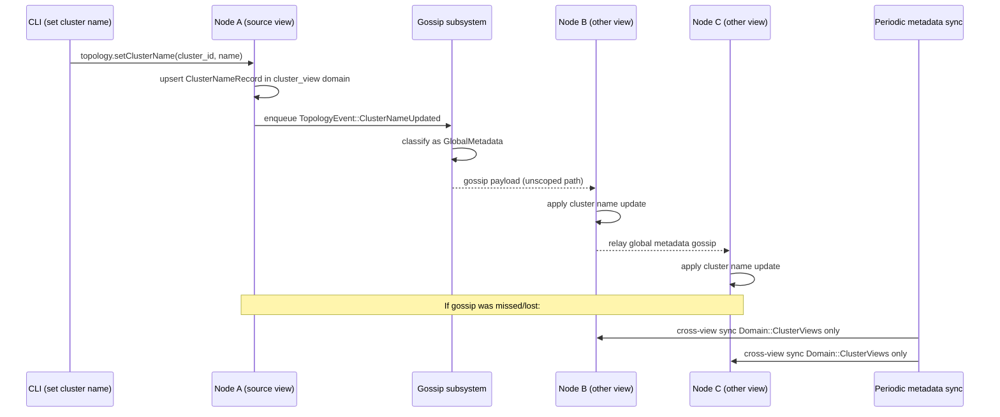

# Cluster View Runtime: Two-Layer Gossip + Sync

## Purpose

This document explains how cluster view scoping works at runtime and how
cluster metadata (currently cluster lineage names) converges with a
two-layer replication strategy:

1. Fast propagation through gossip.
2. Guaranteed repair through anti-entropy sync.

For the broader replicated-state model, see `docs/data-replication.md`.
For merge and split workflows, see `docs/cluster-views-and-operations.md`.

The design keeps high-volume control-plane traffic view-scoped while allowing
selected low-rate metadata to cross cluster view boundaries.

## Core concepts

### `ClusterId` vs `ClusterViewId`

`ClusterId` is the lineage identity.  
`ClusterViewId` is one lineage state (`cluster_id + epoch`).

Every node has one active `ClusterViewId`.

### View boundary

A split creates multiple active views. Runtime loops that manage high-volume
state (tasks/services/networks/peer liveness) stay scoped to the local active
view to avoid cross-view amplification and semantic conflicts.

### Cluster metadata

Cluster names are stored in the cluster view domain as conflict-resolved
records (`ClusterNameRecord`) with deterministic ordering:

1. `updated_at_unix_ms`
2. `actor_node_id`
3. `name`

This keeps a single winner across peers.

## Why two layers

Gossip alone is low-latency but lossy.  
Sync alone is reliable but slower.

Combining both gives:

1. Fast initial spread.
2. Deterministic eventual convergence even with loss, restart, or missed relays.

## Replication planes

| Plane | Scope | Current payloads | Goal |
| --- | --- | --- | --- |
| View-scoped | Active view only | join/leave/alive/suspect/down, tasks, services, network, secrets | Efficiency and isolation |
| Global metadata | Cross-view | `TopologyEvent::ClusterNameUpdated` | Cross-boundary metadata convergence |

## High-level topology

## Layer 1: gossip behavior

### Classification

Gossip classifies each message into one plane:

1. `ViewScoped`
2. `GlobalMetadata`

`ClusterNameUpdated` is currently the only `GlobalMetadata` event.

### Outbound routing

1. View-scoped messages use scoped peers and scoped gossip capabilities.
2. Global metadata messages use unscoped peers and unscoped gossip capabilities.

### Inbound validation

1. View-scoped messages are rejected on view mismatch.
2. Global metadata messages are accepted across view boundaries.

### Relay policy

Global metadata is relayed even when generic inbound relay is disabled, so
cluster name updates continue to spread quickly without enabling broad relay
for high-volume domains.

### Gossip pipeline

## Layer 2: anti-entropy sync behavior

Two periodic loops run in topology:

1. View-scoped loop:
   - syncs all domains with peers in the active view.
2. Global metadata loop:
   - syncs only `Domain::ClusterViews` with peers across view boundaries.

### Why selective sync for cross-view

Cross-view sync is intentionally limited to metadata:

1. avoids pulling heavy domains across split boundaries,
2. preserves view isolation for workload/runtime state,
3. still repairs missed metadata updates.

### Sync loop interaction

## End-to-end cluster name update flow

## Convergence properties

### Fast path

Global metadata gossip gives low-latency spread and relay across view
boundaries.

### Repair path

Global metadata anti-entropy guarantees eventual convergence when gossip misses.

The metadata sync loop uses deterministic round-robin peer selection. With
peer count `N` and fanout `F` (`F > 0`), one node sweeps all peers in:

`ceil((N - 1) / F)` ticks

With `F = 0`, the node targets all known peers each tick.

This removes "random fanout luck" from coverage.

## Scope and safety rules

1. Cross-view replication is opt-in by domain/event.
2. Only metadata with cross-view semantics should use the global plane.
3. Workload/runtime domains remain view-scoped by default.
4. Sync requests still validate against the remote peer's active view.

## Runtime knobs

### Existing knobs

1. `MANTISSA_SYNC_PARALLELISM` (view-scoped loop parallelism)
2. `MANTISSA_GOSSIP_RELAY_INBOUND` (generic inbound relay)

### Global metadata sync knobs

1. `MANTISSA_GLOBAL_METADATA_SYNC_TICK_MS`
2. `MANTISSA_GLOBAL_METADATA_SYNC_FANOUT`
3. `MANTISSA_GLOBAL_METADATA_SYNC_PARALLELISM`

## Code map

### Gossip plane selection and routing

1. `src/gossip/mod.rs`
2. `src/topology/mod.rs` (`GossipContext` unscoped peer/capability path)
3. `src/registry/mod.rs` (`gossip_client_for_unscoped`)

### Selective anti-entropy

1. `src/sync/delta.rs` (`sync_selected_domains`)
2. `src/topology/mod.rs` (`periodic_global_metadata_sync_tick`)
3. `src/registry/mod.rs` (`fetch_sync_capability_unscoped`)

### Cluster metadata storage

1. `src/store/cluster_view_store.rs`

## Extending cross-view replication to additional domains

The design intentionally supports selective expansion.

For a new domain/event:

1. Add the domain to the global metadata sync domain list.
2. Route corresponding gossip events through `GlobalMetadata` plane.
3. Keep conflict resolution deterministic in the domain store.
4. Add split-view tests for:
   - gossip-only convergence,
   - sync-only convergence,
   - mixed loss/restart scenarios.

Do not add high-volume runtime domains unless cross-view semantics are
explicitly required and load implications are acceptable.

## Operational guidance

1. Use gossip for low-latency user-visible metadata.
2. Treat sync as the authoritative convergence guarantee.
3. Tune metadata fanout/tick based on expected peer count and acceptable
   propagation tail latency.
4. Keep global plane payloads minimal and stable.
