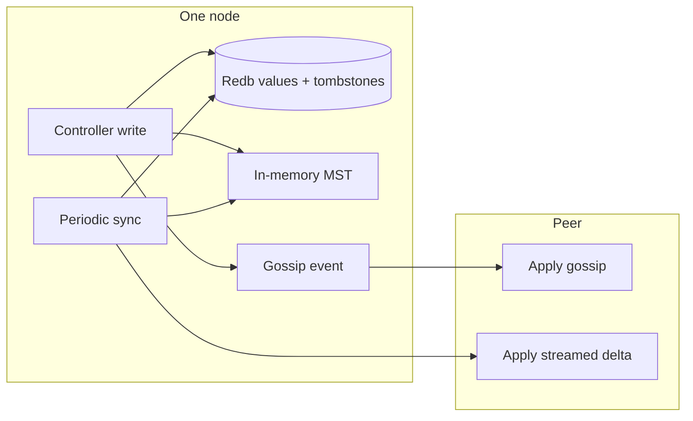
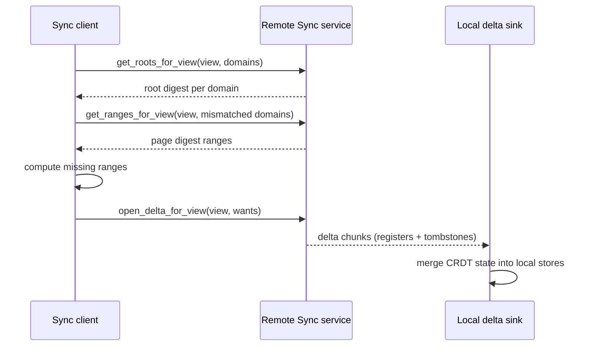

# Data Replication

Mantissa replicates control-plane state through a per-domain CRDT store backed
by Redb and indexed by an in-memory Merkle Search Tree (MST). Gossip provides
fast dissemination, and anti-entropy sync repairs anything gossip misses.

This document describes the current implementation. It covers replicated
domains and their transport paths. It does not cover purely local state such as
join tokens, local session tickets, or prepared scheduler leases.

## Design Summary

Each replicated domain has the same basic shape:

1. durable CRDT register rows in Redb,
2. durable tombstones for deletions,
3. an in-memory MST built from canonical snapshots of those rows,
4. gossip events for low-latency propagation,
5. a roots -> ranges -> delta sync protocol for eventual repair.

The important boundary is that the durable source of truth is the register and
tombstone data in Redb. The MST is a derived index used to compare state
cheaply and export only the missing key ranges during repair.

## Storage Model

Mantissa uses `crdt_store::mst_store::CrdtMstStore` for replicated domains.
Each store combines:

- an MVReg-backed register for active values,
- a tombstone table for deletes,
- an MST leaf per key representing either an active snapshot or a delete
  marker.

The generic implementation lives in:

- `crates/crdt_store/src/mst_store.rs`
- `crates/crdt_store/src/adapter.rs`
- `crates/crdt_store/src/mvreg.rs`
- `crates/crdt_store/src/hash.rs`

Domain wrappers live under `src/store/` such as:

- `src/store/workload_store.rs`
- `src/store/service_store.rs`
- `src/store/network_store.rs`
- `src/store/volume_store.rs`
- `src/store/cluster_view_store.rs`

## Replicated Domains

View-scoped sync currently serves these domains in a stable order:

| Domain | Stored data |
| --- | --- |
| `Peers` | peer metadata, liveness-adjacent control-plane rows |
| `Workloads` | generic schedulable workload rows |
| `Services` | service specs and rollout state |
| `Jobs` | job controller records |
| `Agents` | agent session and run records |
| `Secrets` | replicated secret metadata and payload state |
| `Networks` | network specs |
| `NetworkPeers` | overlay peer state |
| `NetworkAttachments` | runtime attachment rows used for routing and discovery |
| `ClusterViews` | cluster lineage metadata such as cluster names and per-lineage node counts |
| `Volumes` | volume specs |
| `VolumeNodes` | per-node realized volume state |
| `SchedulerDigests` | coarse scheduling summaries per node |

The sync service is defined in:

- `src/sync/mod.rs`
- `src/sync/delta.rs`

## Canonical Snapshots and Hashing

The MST does not hash raw Redb rows directly. It hashes a canonical leaf entry
derived from CRDT state:

- active leaves store a sorted MVReg snapshot,
- deleted leaves store a tombstone timestamp,
- the MST hasher is `XXHash128`.

That means the root digest changes only when the effective state changes, not
because Redb happened to store rows in a different physical layout.

Relevant code:

- `crates/crdt_store/src/mvreg.rs`
- `crates/crdt_store/src/hash.rs`

## Write Path

Most control-plane writes follow the same pattern:

1. update the local domain store,
2. update the in-memory MST,
3. enqueue a domain-specific gossip event,
4. let periodic sync repair any missed peers later.

Deletes write durable tombstones instead of silently removing the key. That
lets remote replicas learn that a key was intentionally removed.

Some stores are opened with `preserve_local_tombs(true)` so stale remote
register deltas cannot immediately resurrect a locally deleted row. Current
examples include:

- `src/store/workload_store.rs`
- `src/store/secret_store.rs`
- `src/store/cluster_view_store.rs`

## Gossip Fast Path

Gossip spreads concrete domain events quickly after local mutation. The gossip
layer also coalesces bursty workload and scheduler digest updates so one flush
tick does not flood peers with stale intermediate states.

Relevant code:

- `src/gossip/mod.rs`
- `src/services/service.rs`
- `src/workload/service.rs`
- `src/network/service.rs`
- `src/volumes/service.rs`

Gossip is intentionally not the only convergence mechanism. Messages can be
lost, peers can restart, and partitions can heal later.

## Anti-Entropy Repair Path

Periodic sync runs in three phases:

1. compare MST roots for each domain,
2. compare page-range digests only for domains whose roots differ,
3. stream only the missing register and tombstone fragments for those ranges.

This is why Mantissa does not need to ship whole maps or full snapshots on
every reconciliation pass. A matching root skips the domain entirely; a
mismatched root narrows work down to only the differing key ranges.

## View Scoping

Most replicated traffic is scoped to the local active `ClusterViewId`.

That applies to:

- gossip receive validation,
- sync RPC validation,
- periodic all-domain anti-entropy.

This keeps split views isolated so high-volume runtime domains do not leak
across cluster-view boundaries.

The main exception today is low-rate cluster lineage metadata in
`Domain::ClusterViews`, which can also converge across view boundaries through
an unscoped metadata plane.

For the runtime details of that split behavior, see
`docs/cluster_view_gossip_sync.md`.

## Cluster-View Metadata

`Domain::ClusterViews` is narrower than the name might suggest. In the current
implementation it stores replicated cluster lineage metadata such as
human-friendly cluster names and replicated per-lineage node counts.

Durable cluster operation records are separate:

- cluster names and per-lineage node counts are replicated through the
  `cluster_views` domain,
- merge/split operation records live in `ClusterOperationStore`,
- startup hydration can rebuild missing cluster names from operation history.

Relevant code:

- `src/store/cluster_view_store.rs`
- `src/store/cluster_operation_store.rs`
- `src/topology/operation_progress.rs`

## Earlier Design Assumptions That No Longer Apply

Older replication sketches no longer matched the implementation:

- Mantissa uses Redb, not Sled.
- Replication is implemented as concrete per-domain stores, not a hypothetical
  future store trait.
- Nodes do not keep one MST per remote node as a general strategy. They keep
  one MST per replicated domain store.
- Cross-view replication is selective and explicit instead of a generic
  cluster-wide MST fanout design.

## Code Map

- `crates/crdt_store/src/mst_store.rs`
- `crates/crdt_store/src/hash.rs`
- `src/gossip/mod.rs`
- `src/sync/mod.rs`
- `src/sync/delta.rs`
- `src/topology/mod.rs`
- `src/store/*.rs`

## Related Documents

- `docs/cluster_view_gossip_sync.md`
- `docs/cluster-views-and-operations.md`
- `docs/distributed-scheduler.md`
