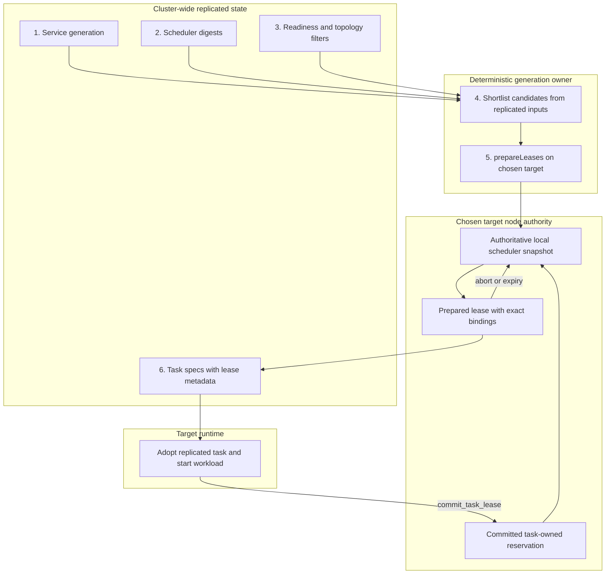
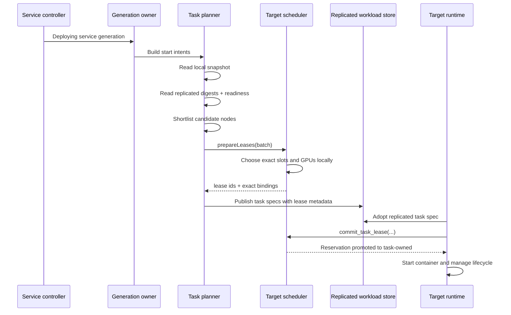
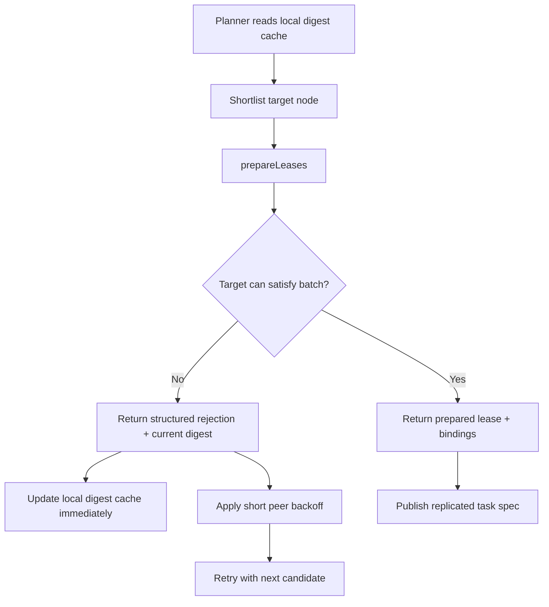
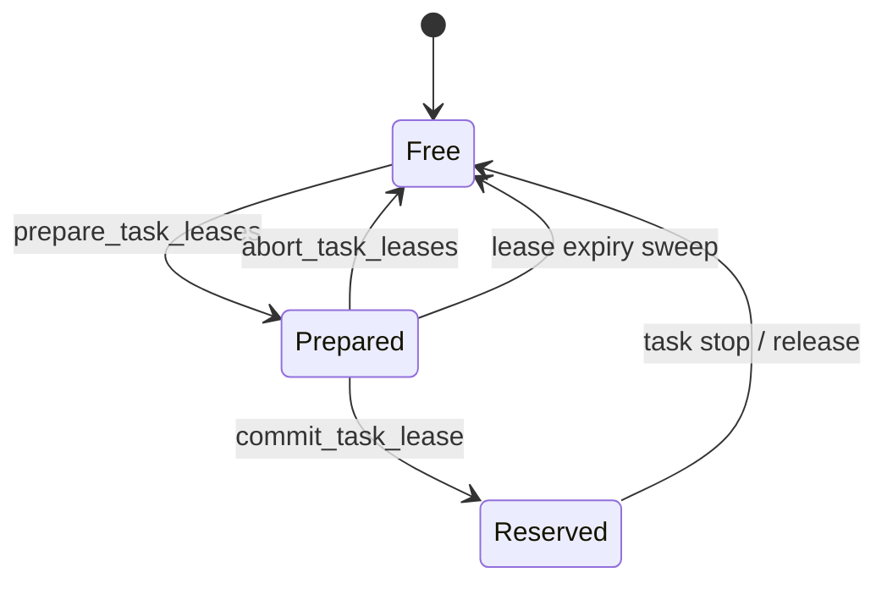

# Distributed Scheduler

This document explains how Mantissa schedules work now.

The important idea is that Mantissa does not replicate exact free-slot state
cluster-wide. Each node remains authoritative for its own local resource
inventory, while the rest of the cluster only sees a compact replicated digest
of that inventory.

That split lets the scheduler stay decentralized without paying the full cost
of cluster-wide remote inspection on every placement.

## Core Model

Mantissa scheduling is built from four pieces:

1. `SchedulerDigest` rows replicated through gossip and sync.
2. One deterministic rollout owner per service generation.
3. Lease preparation on the target node, where exact slots and GPUs are chosen.
4. Runtime-side lease commit or abort once the task is actually adopted.

In practice this means:

- candidate discovery is local and digest-driven,
- exact allocation is always local to the target node,
- failed shortlist guesses are retried as cheap lease prepares,
- task specs are only materialized after a target node has accepted capacity.

## Data Authority

Read the diagram top to bottom:

- replicated state tells the owner what should run and which nodes look viable,
- the target node alone chooses exact slots and GPUs,
- the replicated task spec publishes the accepted decision to the cluster,
- the runtime either commits that prepared lease or the lease expires and
  returns capacity locally.

## What Is Replicated

The scheduler does not replicate full slot maps.

Replicated:

- one compact digest per node,
- task specs,
- service specs,
- readiness and topology inputs used to filter candidates.

Local-only:

- exact slot inventory,
- exact GPU inventory,
- prepared leases that have not been committed yet,
- lease expiry and reclamation.

This is the key boundary in the design. A stale digest can produce a bad
shortlist choice, but it cannot create a conflicting reservation because the
target node still validates and allocates locally.

## Scheduler Digest

Each node publishes a digest that summarizes coarse capacity:

- free slot count,
- free CPU and memory,
- largest free slot shape,
- free GPU count,
- whether the local GPU runtime is ready,
- the local snapshot version.

The planner uses digests only for shortlisting and coarse accounting. They are
advisory, not authoritative.

## Normal Scheduling Flow

## Why One Generation Owner Matters

Service generations are not executed by every node that notices a new
`Deploying` spec. Mantissa picks one deterministic owner for a given
`(service_id, service_epoch)` using rendezvous hashing.

That owner:

- resumes an incomplete initial deployment from persisted task ids,
- resumes a redeploy from the stored `previous_generation`,
- waits for readiness once all task ids are assigned.

This reduces competing rollout work and makes task sets settle earlier, which
also helps task-root convergence after large deployments.

## Candidate Selection

The planner now works in two stages.

First it places as much as it can locally from the exact local scheduler
snapshot.

Then it builds a bounded remote shortlist from observed digests:

1. skip unschedulable or unknown peers,
2. skip peers that cannot satisfy hard requirements,
3. prefer targeted peers when a task was pinned,
4. rank fresh digests above stale ones,
5. rank peers that have not just rejected prepares above backed-off peers.

The old detailed remote summary path is no longer part of the hot path.
`summary` remains a diagnostic surface only.

## Stale Digest and Retry Path

This is an important change. A stale shortlist miss is now a cheap rejection at
the resource-vector level instead of a stale exact-slot reservation failure.

## Lease Lifecycle

Prepared leases are durable enough to survive restart and short enough to
self-recover if the coordinator or runtime disappears.

## Why This Improved Post-deployment Stability

One effect of this design is that task rows stop churning sooner after large
deployments.

The main reasons are:

1. remote placements do not materialize task specs until `prepareLeases`
   succeeds,
2. the target node chooses exact bindings locally, so there are fewer stale
   slot-level retries,
3. structured rejections refresh digests immediately,
4. one deterministic owner executes each service generation.

When the active task count is reached, nodes may still have different task
roots because dissemination is incomplete, but the underlying task set is
usually already much more stable than before.

## Operational Implications

- `summary` is still available for operator diagnostics, but not for planning.
- Lease-held resources are real temporary capacity consumption and should be
  visible in scheduler diagnostics.
- A failed prepare does not imply a bug. It often means the local digest view
  was stale or another node won the race for that capacity.
- Prepared leases must always end in one of three states:
  - committed,
  - aborted,
  - expired.

## Code Map

Main files for this flow:

- `src/services/manager.rs`
- `src/services/ownership.rs`
- `src/task/manager/planner.rs`
- `src/task/manager/reservation.rs`
- `src/task/manager/state.rs`
- `src/task/manager/remote_advisory.rs`
- `src/scheduler/mod.rs`
- `src/scheduler/digest.rs`
- `src/scheduler/service.rs`

Replication wiring:

- `src/gossip/mod.rs`
- `src/sync/mod.rs`
- `src/sync/delta.rs`
- `src/topology/mod.rs`

## Related Documents

- `docs/service-rollouts.md`
- `docs/cluster_view_gossip_sync.md`
- `docs/stress-test.md`
