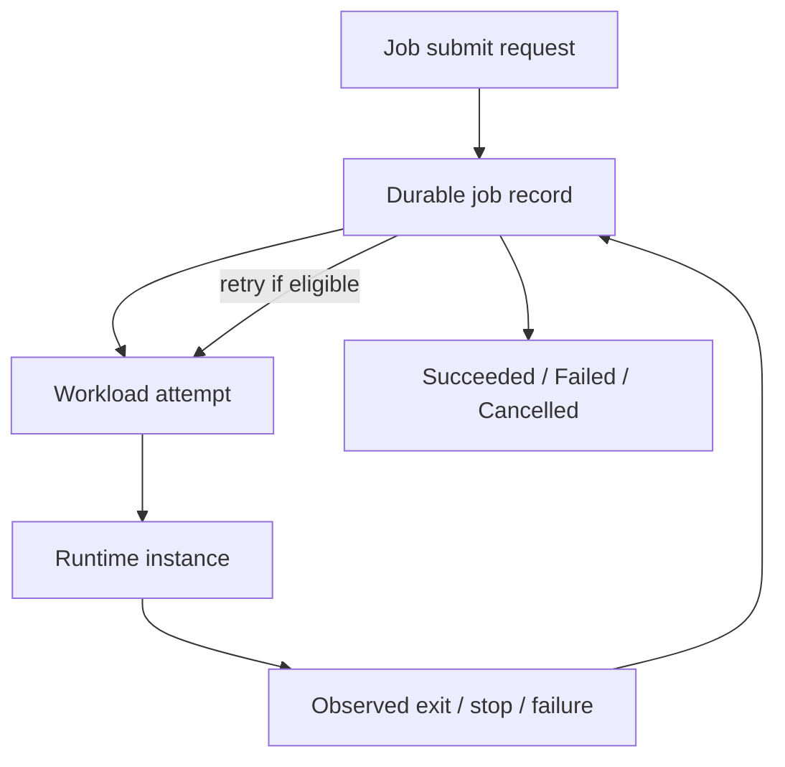

# Jobs Control Plane

Mantissa jobs are first-class controller objects for finite work. They are not
services with fewer features, and they are not just direct tasks with a retry
counter glued on top. A job owns the lifecycle semantics for one repeated
execution template: submission, retry, cancellation, terminal outcome, and
cleanup.

This document explains how that controller fits into the rest of the system,
what state lives where, how retries and failover work, and where the code is
organized.

## The Model

The clean way to read the jobs design is to separate three layers:

- the job record, which is the durable controller object,
- workload attempts, which are the schedulable rows owned by that controller,
- runtime instances, which are the actual local executions on nodes.

That split is the key design choice behind the implementation. The controller
can survive retries, owner failover, and restarts because the durable record is
separate from any one runtime instance.

## What A Job Owns

A job owns:

- completion semantics,
- retry policy,
- cancellation intent,
- deletion eligibility,
- timestamps and terminal summary.

A job does not own:

- replica counts,
- readiness publication,
- public ports,
- rollout strategy,
- dependency graphs between templates.

Those are service concerns. Jobs stay intentionally narrower.

## Public Surface Versus Internal State

The jobs surface is intentionally split between public API shapes and the
internal replicated controller record.

The public API is job-shaped:

- `JobSubmitSpec` is the submit contract,
- `JobSnapshot` is the compact public summary,
- `JobDetail` is the richer inspect view.

The internal durable record is controller-shaped:

- `JobSpecValue` in
  [src/jobs/types.rs](/Users/abronan/hack/mantissa/src/jobs/types.rs).

That split matters for maintenance. Public submission and public inspection
evolve around operator needs, while the internal controller record evolves
around reconciliation and replication. One should not leak directly into the
other.

The wire surface lives in
[crates/mantissa-protocol/schema/jobs.capnp](/Users/abronan/hack/mantissa/crates/mantissa-protocol/schema/jobs.capnp),
the RPC service lives in
[src/jobs/service.rs](/Users/abronan/hack/mantissa/src/jobs/service.rs),
and the controller lives in
[src/jobs/manager.rs](/Users/abronan/hack/mantissa/src/jobs/manager.rs).

## Job Attempts And Workloads

Jobs do not keep a second private execution store. Each job attempt is recorded
as a shared workload row owned by the job controller through
`WorkloadOwner::JobAttempt`.

That gives the jobs controller three useful properties:

- it reuses the same scheduler and runtime path as tasks, services, and agents,
- it does not duplicate runtime state into a parallel attempt ledger,
- it can derive attempt detail on demand from workload ownership.

The durable links that matter are:

- `active_workload_id`,
- `last_workload_id`,
- `successful_workload_id`.

Those are controller pointers into the shared workload layer. The full attempt
history used by `jobs inspect` is derived from the workload store rather than
stored directly inside the job record.

## Execution And Runtime Intent

Jobs reuse the shared `ExecutionSpec` / `ResolvedExecutionSpec` model for the
actual execution template, but runtime intent stays at the job level:

- `execution_platform`,
- `isolation_mode`,
- `isolation_profile`.

That is deliberate. Platform and isolation are part of controller intent, not
part of the reusable execution payload itself.

This means a retry or adopted job reuses the same execution template and the
same runtime intent without reconstructing defaults in the controller.

## Lifecycle

The coarse controller lifecycle is:

- `pending`,
- `running`,
- `retrying`,
- `cancelling`,
- `cancelled`,
- `succeeded`,
- `failed`.

The controller also records:

- `created_at`,
- `started_at`,
- `completed_at`,
- `terminal_exit_code` when one exists.

The important boundary is that jobs record controller summary, not runtime
history. Detailed runtime state still lives on workload rows.

### Success

An attempt succeeds when the owned workload reaches `Exited(0)`. The controller
records terminal success and stops launching further attempts.

### Retry

An attempt that exits non-zero may move the job into `retrying` if retries
remain. The controller persists the retry deadline, waits out the backoff, and
then launches the next workload attempt.

### Cancellation

Cancellation is controller intent first and runtime action second. A job moves
to `cancelling`, the controller requests stop on the active workload if one
exists, and only then converges to `cancelled`.

### Deletion

Deletion is restricted to terminal jobs. The controller record is removed
through the replicated job store only after the job is already `succeeded`,
`failed`, or `cancelled`.

## Ownership, Failover, And Recovery

Jobs are part of the ordinary distributed control plane. They are not pinned to
one immortal leader.

The controller owner is selected deterministically. The owner is responsible
for reconciliation: launching eligible attempts, observing owned workloads, and
driving retries or cancellation forward.

If that owner leaves, another node can adopt the same durable job record and
continue reconciliation. That is why the controller persists:

- retry policy,
- retry deadline,
- runtime intent,
- lifecycle timestamps,
- workload pointers.

Those fields are enough for a new owner to continue the job without requiring
the original node to still exist.

The implementation also survives controller restarts. Persisted retry deadlines
and the durable controller summary are sufficient to resume the correct retry
window after bootstrap.

## Observability

Jobs are meant to be operable from the jobs surface without forcing every user
to manually inspect workload rows.

The public operator path is:

- `mantissa jobs list`,
- `mantissa jobs inspect <JOB_ID>`,
- `mantissa jobs wait <JOB_ID>`,
- `mantissa jobs logs <JOB_ID>`,
- `mantissa jobs cancel <JOB_ID>`,
- `mantissa jobs delete <JOB_ID>`.

`jobs inspect` is the important bridge between the controller and the shared
workload layer. It combines:

- the durable controller summary,
- derived attempt snapshots from workload ownership,
- the preferred logs target.

This gives operators workload-level visibility without exposing the internal
workload RPC as the primary jobs interface.

## Submission Paths

Jobs support two submission styles:

- raw flag submission with `mantissa jobs run`,
- manifest-driven submission with `mantissa jobs run --file`.

The manifest path is the production-oriented one. It supports:

- the shared execution template,
- retry policy,
- declared volumes,
- named networks,
- platform and isolation selection,
- termination grace period,
- pre-stop command,
- local liveness probes.

The parser and submit path live in
[crates/mantissa-client/src/jobs/manifest.rs](/Users/abronan/hack/mantissa/crates/mantissa-client/src/jobs/manifest.rs)
and
[crates/mantissa-client/src/jobs/run.rs](/Users/abronan/hack/mantissa/crates/mantissa-client/src/jobs/run.rs).

The shipped examples in `examples/` are also parsed in tests, which means they
are treated as maintained assets rather than as prose-only examples.

## Interaction With Volumes And Networks

Jobs can declare volumes and named networks, but they use job semantics rather
than service semantics.

There is one execution template and one active attempt at a time. A declared
volume therefore follows the locality of the workload attempt that mounts it.
This keeps the model simpler than a service rollout while still making jobs
practical for finite work that needs state or overlay connectivity.

The client-side provisioning helpers are shared with the service submit path so
jobs and services do not drift in volume and network preparation behavior.

## Coverage And Production Confidence

The jobs implementation is backed by real integration coverage rather than only
store-level mutation tests.

The suite covers:

- successful completion through runtime exit observation,
- retry after failed attempts,
- cancellation,
- deletion after terminal completion,
- runtime intent propagation,
- retry backoff across controller restart,
- owner failover while retrying.

The main integration file is
[tests/jobs.rs](/Users/abronan/hack/mantissa/tests/jobs.rs).

That coverage does not prove every future job feature, but it does establish
that the current control-plane slice is real: submission, reconciliation,
retry, cancellation, failover, and recovery are part of the tested system, not
just protocol surface area.

## Code Map

If you need to work on jobs, this is the shortest useful map:

| Area | Primary code |
| --- | --- |
| Public operator docs | [docs/jobs.md](/Users/abronan/hack/mantissa/docs/jobs.md) |
| Public jobs protocol | [crates/mantissa-protocol/schema/jobs.capnp](/Users/abronan/hack/mantissa/crates/mantissa-protocol/schema/jobs.capnp) |
| Jobs RPC service | [src/jobs/service.rs](/Users/abronan/hack/mantissa/src/jobs/service.rs) |
| Durable job model | [src/jobs/types.rs](/Users/abronan/hack/mantissa/src/jobs/types.rs) |
| Job reconciliation | [src/jobs/manager.rs](/Users/abronan/hack/mantissa/src/jobs/manager.rs) |
| Client submit path | [crates/mantissa-client/src/jobs/run.rs](/Users/abronan/hack/mantissa/crates/mantissa-client/src/jobs/run.rs) |
| Client manifest parser | [crates/mantissa-client/src/jobs/manifest.rs](/Users/abronan/hack/mantissa/crates/mantissa-client/src/jobs/manifest.rs) |
| Client inspect/list data | [crates/mantissa-client/src/jobs/snapshot.rs](/Users/abronan/hack/mantissa/crates/mantissa-client/src/jobs/snapshot.rs) |
| CLI inspect/list rendering | [crates/mantissa-cli/src/jobs/snapshot.rs](/Users/abronan/hack/mantissa/crates/mantissa-cli/src/jobs/snapshot.rs) |
| Shared workload layer | [src/workload](/Users/abronan/hack/mantissa/src/workload) |
| Integration coverage | [tests/jobs.rs](/Users/abronan/hack/mantissa/tests/jobs.rs) |

## Relationship To Other Docs

Use [docs/jobs.md](/Users/abronan/hack/mantissa/docs/jobs.md) when you want the
operator surface: manifests, commands, logs, examples, and day-to-day usage.

Use [docs/workloads-and-runtimes.md](/Users/abronan/hack/mantissa/docs/workloads-and-runtimes.md)
when you want the broader architecture across tasks, services, jobs, agents,
platforms, isolation, and runtime backends.
