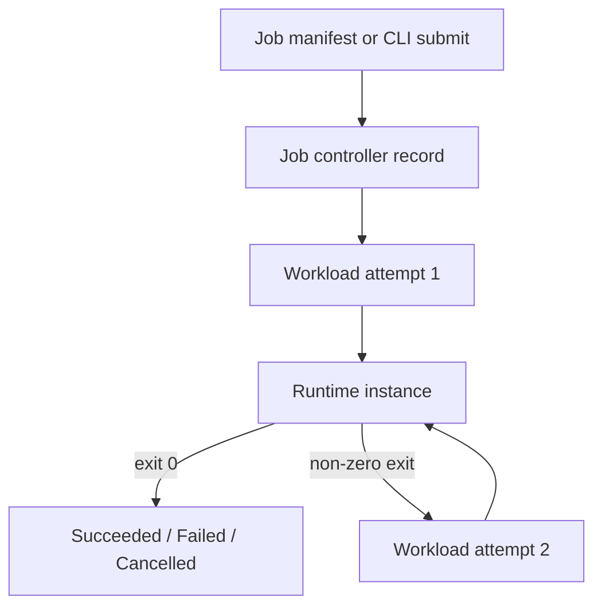

# Jobs

Mantissa jobs are the control-plane surface for finite work. A job is not a
short-lived service and it is not just a renamed direct task. A job is a
durable controller record that owns retry, cancellation, and terminal outcome
semantics for one repeated execution template.

For the controller architecture, ownership model, failover behavior, and code
layout behind that operator surface, see
[docs/jobs-control-plane.md](/Users/abronan/hack/mantissa/docs/jobs-control-plane.md).

The simplest way to read the model is:

- a job is the durable controller object,
- each job attempt is a workload row owned by that controller,
- each workload attempt becomes one runtime instance on some node.

That split matters because the job record can survive retries, owner failover,
and controller restarts even though each underlying workload attempt is finite.



## Jobs, Tasks, and Services

A direct task is one standalone execution requested by an operator. A service is
desired state for long-lived replicated work. A job sits between those two
ideas: it is finite like a task, but it is controller-owned like a service.

The shared workload layer underneath them stays the same. What changes is
the owning controller and the policy above the execution layer.

| Concept | Owns retries and completion? | Owns replica counts and readiness? | Consumes runtime directly? |
| --- | --- | --- | --- |
| Task | No | No | Yes |
| Service | No | Yes | Not by itself; it launches replicas |
| Job | Yes | No | Not by itself; it launches attempts |

If you need one command to run once and then stop, use a job. If you need a
replicated workload to stay alive and routable, use a service.

## Submission Surfaces

Jobs can be submitted in two ways:

- ad hoc with `mantissa jobs run` flags,
- declaratively with `mantissa jobs run --file <manifest.ron>`.

The file-based path is the production-oriented one. It carries the full shared
execution template, declared volumes, named networks, runtime selection, and
retry policy in one durable input.

## Job Manifest Shape

The top-level job manifest separates controller fields from execution fields.

```ron
(
    name: "simple-job",
    execution_platform: "oci",
    isolation_mode: "standard",
    execution: (
        image: "alpine:3.20",
        command: ["sh", "-lc", "echo 'hello from Mantissa'"],
        resources: (
            cpu_millis: 250,
            memory_mb: 128,
        ),
    ),
    retry_policy: (
        max_retries: 0,
        backoff_secs: 2,
    ),
)
```

The top level answers controller and runtime questions:

| Field | Meaning |
| --- | --- |
| `name` | Human-facing durable job name |
| `execution_platform` | Requested execution family, currently `oci` or `microvm` |
| `isolation_mode` | Requested isolation contract, currently `standard` or `sandboxed` |
| `isolation_profile` | Optional named isolation profile |
| `volumes` | Declared volumes to provision before submission |
| `retry_policy` | Controller-owned retry budget and backoff |

The nested `execution` block answers execution-template questions:

| Field | Meaning |
| --- | --- |
| `image`, `command`, `tty` | Runtime entrypoint behavior |
| `resources` | CPU, memory, and GPU requests |
| `termination_grace_period_secs` | Grace period before forced stop |
| `pre_stop_command` | Command run inside the instance before shutdown |
| `env`, `secret_files` | Environment and mounted secrets |
| `volumes`, `networks` | Mounted volumes and attached overlay networks |
| `liveness` | Optional local liveness probe |

One design rule is worth keeping in mind: runtime selection is not embedded
inside `execution`. It stays at the top level because platform and isolation
belong to controller intent, not to the reusable execution payload itself.

## Example Manifests

The repository ships three job manifests in `examples/`:

| File | What it demonstrates |
| --- | --- |
| `examples/simple_job.ron` | One successful finite job with no retries |
| `examples/retrying_job.ron` | Controller-owned retry behavior after non-zero exits |
| `examples/job_with_volume.ron` | Declared volume provisioning, named network provisioning, and sandboxed OCI execution |

Submit them with:

```sh
mantissa jobs run --file examples/simple_job.ron
mantissa jobs run --file examples/retrying_job.ron
mantissa jobs run --file examples/job_with_volume.ron
```

The examples are also parsed in the unit test suite so they stay aligned with
the current manifest contract.

## Runtime Selection

Jobs use the same runtime model as the rest of the workload system.

`execution_platform` answers where the workload should run. Today the shared
model recognizes `oci` and `microvm`.

`isolation_mode` answers how strongly the attempt should be isolated. Today the
shared model recognizes `standard` and `sandboxed`.

`isolation_profile` is an optional named runtime policy layered on top of those
two fields.

This means a job can ask for OCI execution with standard isolation, OCI
execution with a sandboxed profile such as `oci-default`, or a future MicroVM
backend once one exists. The job controller persists that runtime intent
durably, so retries and owner failover relaunch the same kind of attempt rather
than reconstructing defaults.

## Retry Semantics

Jobs do not use workload restart policy. They use controller-owned retry policy.

That distinction is intentional:

- workload restart policy is local runtime behavior for one running instance,
- job retry policy is controller behavior across multiple finite attempts.

For jobs, retries are expressed only through `retry_policy`:

- `max_retries` is the number of retries after the initial attempt,
- `backoff_secs` is the delay before the next attempt becomes eligible.

If an attempt exits with a non-zero status and retries remain, the job moves to
`retrying`, waits for the backoff deadline, and then launches a new workload
attempt. If retries are exhausted, the job moves to `failed`.

If an attempt exits with status code `0`, the job moves to `succeeded`.

## Observing Jobs

The jobs surface is meant to be usable without manually discovering workload ids
for everyday operations.

```sh
mantissa jobs list
mantissa jobs inspect <JOB_ID>
mantissa jobs wait <JOB_ID>
mantissa jobs logs <JOB_ID> -f
```

`jobs list` shows the controller summary for each durable job: name, status,
runtime selection, active workload, timestamps, and terminal exit code when one
exists.

`jobs inspect` expands that summary with derived attempt details from the shared
workload store. Each attempt includes:

- workload id and workload name,
- current workload phase,
- node placement,
- creation and update timestamps,
- terminal exit code when present,
- platform and isolation for that attempt,
- whether the attempt is the current active, last, or successful attempt.

`jobs logs` is a convenience command layered on top of `jobs inspect`. It
resolves the active or last visible workload attempt and then streams runtime
logs through the existing task log path.

## Cancelling and Deleting Jobs

Jobs are explicit control-plane objects, so cancellation and cleanup happen at
the jobs layer rather than by deleting workload rows directly.

```sh
mantissa jobs cancel <JOB_ID>
mantissa jobs delete <JOB_ID>
```

Cancellation is controller intent. The job first moves into `cancelling`, then
the controller stops the active workload attempt if one exists, and finally the
job converges to `cancelled`.

Deletion is only allowed for terminal jobs. A job must already be in one of:

- `succeeded`
- `failed`
- `cancelled`

before it can be removed from the replicated jobs surface.

## Volumes and Networks

Manifest-backed jobs can declare volumes and named networks the same way
services do, but with job semantics instead of service semantics.

Declared top-level volumes are provisioned before submission. Workload mounts in
`execution.volumes` then refer to those declared volume names. Named overlay
networks in `execution.networks` are also ensured before submission.

The current `examples/job_with_volume.ron` example shows the intended pattern:

- declare the volume once at the top level,
- mount it inside the execution template,
- let `wait_for_first_consumer` binding choose the first hosting node at launch
  time.

## Failure and Recovery Model

Jobs are durable replicated controller objects. The current controller behavior
is designed to survive:

- owner re-election when the current owner leaves,
- persisted retry deadlines across controller restart,
- repeated workload attempts with the same execution and runtime intent.

The integration suite covers:

- successful completion through real runtime exit observation,
- retry after failed attempts,
- cancellation,
- deletion after terminal completion,
- runtime selection propagation,
- retry backoff after controller restart,
- owner failover while a job is retrying.

That test coverage is what makes the jobs surface a supported feature rather
than a partially exposed internal controller.
