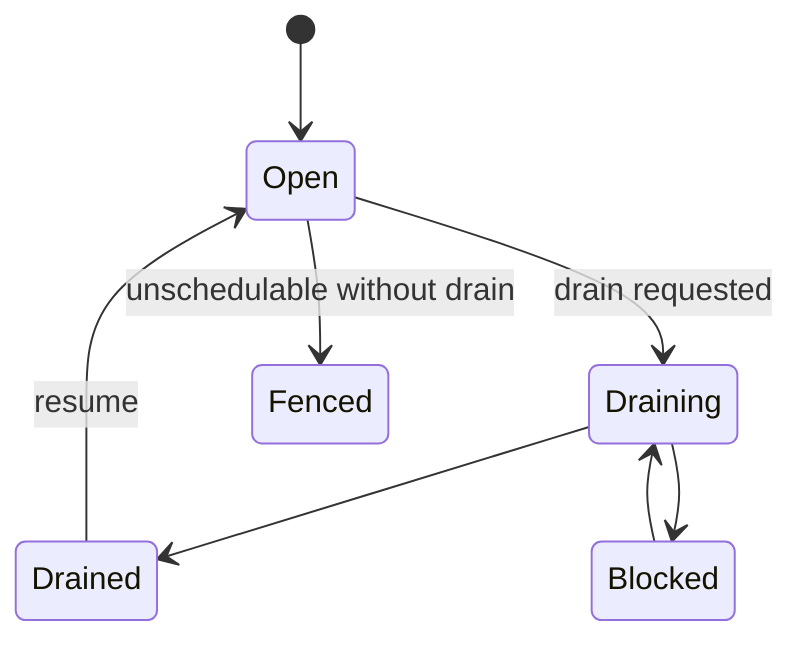

# Node Maintenance and Drain

`mantissa nodes drain` is the maintenance fence for a node. It is not just a
label or a soft hint. A drain request makes the node unschedulable immediately
and drives service reconciliation to move service-owned work away from it.

## Commands

Fence and wait for completion:

```bash
mantissa nodes drain <node-id> --reason "kernel upgrade"
```

Fence without waiting:

```bash
mantissa nodes drain <node-id> --no-wait
```

Override task stop timeout while draining:

```bash
mantissa nodes drain <node-id> --task-stop-timeout 45s
```

Inspect progress:

```bash
mantissa nodes status <node-id>
```

Clear the maintenance fence:

```bash
mantissa nodes resume <node-id>
```

## What Drain Changes

A drain request writes a timestamped peer scheduling state:

- `schedulable = false`
- `drain_requested = true`
- optional reason text,
- optional task stop timeout override.

That state is replicated like other peer metadata, so placement and
reconciliation loops converge on the same fence.

## Placement Effects

Once a node is draining:

- new service placements exclude it,
- untargeted workload placement excludes it,
- service-owned local restarts are suppressed on that node,
- service slot reconciliation treats tasks on that node as explicit drift and
  starts replacements elsewhere.

This is what makes drain an actual evacuation mechanism instead of a cosmetic
schedulability bit.

## Drain States

`mantissa nodes status` derives one operator-facing drain state:

- `open`: node is schedulable and no drain is requested,
- `fenced`: node is unschedulable but no active drain is requested,
- `draining`: drain is active and work is still evacuating,
- `drained`: no service tasks or reservations remain,
- `blocked`: Mantissa found a blocker that prevents safe evacuation.



## What Counts As Complete

Drain is considered complete when all of these are true:

- no remaining service-managed tasks are active on the node,
- the local scheduler shows no remaining reserved slots,
- the local scheduler shows no remaining reserved GPUs.

The blocking client path polls `getNodeDrainStatus` until the node reaches
`drained` or the CLI timeout expires.

## Blockers

Drain fails fast or reports `blocked` when the current control plane cannot
move the work safely.

Current blockers include:

- active standalone tasks,
- active local-volume tasks,
- service tasks with no schedulable replacement node,
- insufficient replacement capacity,
- service state that makes evacuation unsafe, such as a stopping service.

The status RPC also reports the last scheduling error for capacity-related
blockers.

## Service Evacuation Model

Service drain uses a start-first handoff:

1. mark the node unschedulable,
2. treat service tasks on that node as missing drift,
3. start the replacement elsewhere,
4. let the drained node stop or lose ownership of the stale local runtime.

That keeps service availability higher than a naive stop-first maintenance
flow, especially when networking or readiness causes replacement retries.

## Standalone Tasks

Standalone tasks do not have a higher-level controller that can recreate them
elsewhere. Mantissa therefore blocks drain while any active standalone task
remains on the node.

Operators must stop those tasks manually before the drain can complete.

## Local Volumes

Node-local volume consumers also block drain. Mantissa refuses to imply that a
local disk can be evacuated transparently.

For the storage model behind that decision, see `docs/volumes.md`.

## Task Stop Timeout Override

`--task-stop-timeout` temporarily overrides the task's own termination grace
period while this node is draining. That gives operators a cluster-wide
maintenance knob without rewriting the workload spec.

## Code Map

- `src/topology/peers.rs`
- `src/topology/service.rs`
- `src/services/slot_reconcile.rs`
- `src/workload/manager/state.rs`
- `crates/client/src/node/drain.rs`
- `crates/client/src/node/status.rs`

## Related Documents

- `docs/distributed-scheduler.md`
- `docs/volumes.md`
