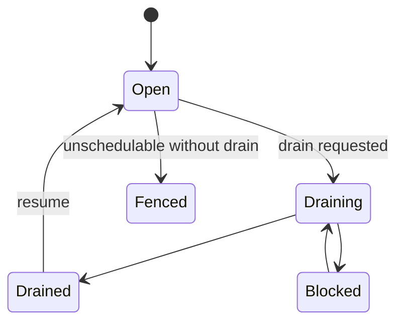

# Node Maintenance and Drain

`mantissa nodes drain` is the maintenance fence for a node. It is not just a
label or a soft hint. A drain request makes the node unschedulable immediately
and drives service reconciliation to move service-owned work away from it.

## Commands

Fence and wait for completion:

```bash
mantissa nodes drain <node-id> --reason "kernel upgrade"
```

Fence without waiting:

```bash
mantissa nodes drain <node-id> --no-wait
```

Override task stop timeout while draining:

```bash
mantissa nodes drain <node-id> --task-stop-timeout 45s
```

Inspect progress:

```bash
mantissa nodes status <node-id>
```

Clear the maintenance fence:

```bash
mantissa nodes resume <node-id>
```

## What Drain Changes

A drain request writes a timestamped peer scheduling state:

- `schedulable = false`
- `drain_requested = true`
- optional reason text,
- optional task stop timeout override.

That state is replicated like other peer metadata, so placement and
reconciliation loops converge on the same fence.

## Placement Effects

Once a node is draining:

- new service placements exclude it,
- untargeted workload placement excludes it,
- service-owned local restarts are suppressed on that node,
- service slot reconciliation treats tasks on that node as explicit drift and
  starts replacements elsewhere.

This is what makes drain an actual evacuation mechanism instead of a cosmetic
schedulability bit.

## Drain States

`mantissa nodes status` derives one operator-facing drain state:

- `open`: node is schedulable and no drain is requested,
- `fenced`: node is unschedulable but no active drain is requested,
- `draining`: drain is active and work is still evacuating,
- `drained`: no service tasks or reservations remain,
- `blocked`: Mantissa found a blocker that prevents safe evacuation.



## What Counts As Complete

Drain is considered complete when all of these are true:

- no remaining service-managed tasks are active on the node,
- the local scheduler shows no remaining reserved slots,
- the local scheduler shows no remaining reserved GPUs.

The blocking client path polls `getNodeDrainStatus` until the node reaches
`drained` or the CLI timeout expires.

## Blockers

Drain fails fast or reports `blocked` when the current control plane cannot
move the work safely.

Current blockers include:

- active standalone tasks,
- active local-volume tasks,
- service tasks with no schedulable replacement node,
- insufficient replacement capacity,
- service state that makes evacuation unsafe, such as a stopping service.

The status RPC also reports the last scheduling error for capacity-related
blockers.

## Service Evacuation Model

Service drain uses a start-first handoff:

1. mark the node unschedulable,
2. treat service tasks on that node as missing drift,
3. start the replacement elsewhere,
4. let the drained node stop or lose ownership of the stale local runtime.

That keeps service availability higher than a naive stop-first maintenance
flow, especially when networking or readiness causes replacement retries.

## What Survives a Mantissa Stop

Mantissa's networking plane is split between:

- kernel-resident eBPF dataplane state, and
- node-local userspace discovery and reconciliation.

That distinction matters during maintenance.

If Mantissa stops after it has already programmed one network:

- attached tc/XDP programs remain attached to the interfaces,
- pinned eBPF maps remain in bpffs,
- already programmed VIP and NodePort forwarding can keep working from the
  last reconciled state.

But some things do **not** continue without the Mantissa process:

- the per-network DNS listener on the resolver IP stops,
- backend health refresh stops,
- VIP and NodePort reconciliation stops,
- stale backends are not removed until Mantissa returns.

In practice that means direct traffic to an already-known VIP may keep flowing,
but fresh `*.svc.mantissa` lookups on that node will fail once the local
resolver is gone.

## Upgrade and Failure Expectations

The intended maintenance workflow is therefore:

1. drain the node,
2. wait for service-managed work to evacuate,
3. restart or upgrade Mantissa,
4. resume the node after it is healthy again.

Under that model, node-local discovery does not need to survive a planned
Mantissa restart. The workloads that still matter should already be running on
nodes whose local discovery loop is up.

For an unplanned Mantissa daemon failure, the cluster can still recover through
normal replica placement and reconciliation on other nodes, but operators
should not assume daemonless service discovery on the failed node itself.
Existing dataplane state may continue forwarding for a while, but fresh service
name resolution on that node depends on Mantissa returning or the workloads
being recreated elsewhere.

## Mantissa Daemon Upgrades

Mantissa uses a root-schema support range to keep distributed state sync safe
while different daemon versions are running during maintenance. Each node
advertises:

- `minimumRootSchemaVersion`: the oldest semantic MST root projection this
  binary can still serve,
- `supportedRootSchemaVersion`: the newest semantic MST root projection this
  binary can serve,
- `rootSchemaPublicationGeneration`: a durable per-node publication counter
  used to make restarts and downgrades win over stale advertisements.

When two nodes sync, they use the highest root schema version that both sides
support. If there is no overlap, join is rejected and sync skips that peer
instead of comparing incompatible MST roots.

The active cluster cutover is therefore pairwise and automatic:

1. a release that introduces root schema `N` should still serve the previous
   production schema while the cluster is being upgraded,
2. old and new nodes sync through the shared schema,
3. new nodes sync with each other through schema `N`,
4. once every node runs a binary that supports schema `N`, all normal sync
   traffic uses schema `N`,
5. a later release may raise `minimumRootSchemaVersion` after the rollback
   window for the older schema has closed.

There is no separate cluster-wide flip bit today. The advertised support ranges
and peer-to-peer negotiation are the cutover mechanism.

## Upgrade Policy

Mantissa upgrades should be treated as bounded hops, not arbitrary jumps across
many root-schema eras. A target binary is a valid rolling-upgrade target only
when its root-schema range overlaps the version currently running in the
cluster.

For example, a node running a binary that only supports schema `1` cannot
rolling-upgrade directly into a binary whose range is `5..=10`. There is no
common schema, so the new daemon cannot safely join or sync with the old
cluster. Use one of these paths instead:

- upgrade through bridge releases whose ranges overlap each step,
- ship a direct-upgrade release that still serves schema `1`,
- stop the whole cluster and perform an offline hard cutover when data loss or
  manual store migration is acceptable.

The same rule applies to rollback. During the rollback window, the upgraded
binary must keep serving the schema understood by the rollback binary. Once a
release raises `minimumRootSchemaVersion`, rolling back to binaries below that
minimum is no longer supported without an offline recovery plan.

## Recommended Upgrade Runbook

For a routine rolling daemon upgrade:

1. confirm the target binary's root-schema range overlaps the currently
   deployed binary,
2. confirm the rollback binary can still read the local store and shares a root
   schema with the target binary,
3. drain one node or a small batch of nodes,
4. wait for service-managed work to evacuate,
5. stop Mantissa on the drained node,
6. install the target binary,
7. start Mantissa and wait for the node to rejoin and sync,
8. resume the node after it is healthy,
9. repeat until every node is upgraded.

After the whole cluster is upgraded, keep the older root schema supported until
the operational rollback window has passed. Only then should a follow-up
release raise the minimum supported root schema.

For a downgrade:

1. verify the downgrade binary overlaps the current cluster root-schema range,
2. drain the node before replacing the binary,
3. start the older binary and let it publish its lower support range,
4. wait for peers to observe the new publication before resuming the node.

The durable publication generation makes a same-node downgrade visible even if
an older, higher-schema advertisement is still present in peer stores.

## Storage Payloads

Redb rows use Cap'n Proto payloads. Replicated CRDT stores use Mantissa-owned
MVReg rows whose values are encoded by each domain's `StoreValueCodec`
implementation. Local bootstrap/authentication rows and cluster-operation rows
also use explicit Cap'n Proto structs.

Routine additive changes should add new Cap'n Proto fields with new field ids.
Do not renumber fields, reuse field ids, or change the meaning of an existing
field. When a field becomes obsolete, keep the field id allocated and stop
depending on it in domain code.

Changing a row's semantics is a store-format change, not only a root-schema
change. Examples include switching a table from MVReg to another CRDT, changing
the meaning of an existing field, or replacing a value with a different payload
struct. Those changes must be handled as a deliberate hard cutover or by adding
an explicit migration for the affected table.

Root-schema negotiation protects MST root compatibility between live peers. It
does not automatically make every old Redb payload readable by every future
binary, and it does not make every new payload meaningful to an older rollback
binary.

## Store GC Operations

Mantissa runs background logical GC for replicated stores when
`storage.gc.enabled` is true.

Tombstone GC is deliberately conservative. A domain can prune tombstones only
after every active peer has an equal-root observation for the current cluster
view and root schema, and only after the tombstones are older than
`storage.gc.tombstone_min_retention_ms`. A stopped daemon that remains an active
member blocks pruning until it returns and syncs.

MVReg compaction is separate from tombstone GC. It is disabled unless
`storage.gc.mvreg_max_values` is configured. Domains that opt in use explicit
ranking rules and merge the vector clocks of dropped values into the retained
winner so stale compacted values do not reappear during later anti-entropy.

For production maintenance, prefer drain and restart over leave and later
reuse. A peer that has left the cluster is outside the active-peer GC barrier.
If that data directory is reused after the tombstone retention window, treat
the node as requiring bootstrap from an active peer or reset replicated stores
before it can safely publish state again.

Logical GC lets Redb reuse pages, but it is not a physical file compaction
workflow. Shrinking the database file should be treated as a separate offline
maintenance operation.

## Root-Schema Change Checklist

When introducing a new root schema:

1. define the new canonical projection for any domain whose MST leaf semantics
   changed,
2. keep the previous production projection available while rolling upgrades and
   rollback are expected,
3. update `SUPPORTED_ROOT_SCHEMA_VERSION` only after the new projection is
   implemented and tested,
4. update `MIN_SUPPORTED_ROOT_SCHEMA_VERSION` only in a later cleanup release,
5. add tests for mixed-version upgrade, full cutover, downgrade, unsupported
   schema rejection, and any store-format hard cutover or migration needed by
   the release.

## Standalone Tasks

Standalone tasks do not have a higher-level controller that can recreate them
elsewhere. Mantissa therefore blocks drain while any active standalone task
remains on the node.

Operators must stop those tasks manually before the drain can complete.

## Local Volumes

Node-local volume consumers also block drain. Mantissa refuses to imply that a
local disk can be evacuated transparently.

For the storage model behind that decision, see `docs/volumes.md`.

## Task Stop Timeout Override

`--task-stop-timeout` temporarily overrides the task's own termination grace
period while this node is draining. That gives operators a cluster-wide
maintenance knob without rewriting the workload spec.

## Code Map

- `src/topology/peers.rs`
- `src/topology/service.rs`
- `src/topology/sync.rs`
- `src/cluster/root_schema.rs`
- `src/sync/gc_progress.rs`
- `src/store/gc.rs`
- `src/config.rs`
- `crates/crdt_store/src/codec.rs`
- `crates/crdt_store/src/gc.rs`
- `crates/crdt_store/src/mst_store.rs`
- `src/services/slot_reconcile.rs`
- `src/workload/manager/state.rs`
- `crates/client/src/node/drain.rs`
- `crates/client/src/node/status.rs`

## Related Documents

- `docs/distributed-scheduler.md`
- `docs/networking-ebpf.md`
- `docs/volumes.md`
