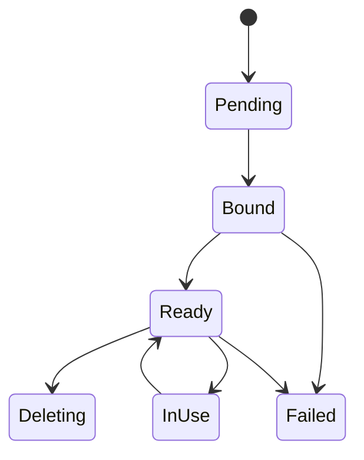

# Volumes

Mantissa currently ships one real volume backend: a cluster-scoped volume
object backed by node-local storage.

That model is intentionally honest:

- the volume object is replicated cluster-wide,
- the data path lives on exactly one node,
- scheduling respects that locality,
- failover does not pretend a local disk became distributed storage.

## Current Scope

Supported today:

- local driver volumes,
- `read_write_once` access mode,
- `immediate` and `wait_for_first_consumer` binding,
- `retain` and `delete` reclaim policies,
- managed local paths and imported host paths,
- service, job, and direct task mounts.

Not implemented yet:

- external drivers,
- read-write-many semantics,
- transparent cross-node replication,
- live migration.

## Data Model

Mantissa replicates two related rows:

1. a cluster-wide `VolumeSpecValue`,
2. per-node `VolumeNodeStateValue` rows for realized local state.

`VolumeSpecValue` carries:

- identity (`id`, `name`, labels),
- driver,
- access mode,
- binding mode,
- reclaim policy,
- optional requested capacity,
- bound node metadata,
- operator-facing status and reason fields.

`VolumeNodeStateValue` carries:

- owning node,
- concrete local path,
- node-local readiness state,
- optional capacity and used bytes,
- the list of tasks currently publishing the mount on that node.

## Driver and Binding Modes

### Local Driver

The built-in driver is `local`.

Managed local volumes create data under the configured local volume root.
Imported local volumes point at an existing absolute host path on a selected
node.

### Access Mode

The only current access mode is `read_write_once`.

That means the volume may only be mounted read-write from one node. Mantissa
enforces that by binding the volume to a single node and treating that binding
as a hard placement constraint.

### Binding Modes

`immediate`

- requires an explicit node at creation time,
- is used for imported paths,
- creates a bound volume object immediately.

`wait_for_first_consumer`

- starts unbound,
- lets the scheduler pick the first hosting node,
- persists that binding before lease reservation and workload start.

## Lifecycle



At the node-local layer, the realized row moves through:

- `Pending`
- `Provisioning`
- `Ready`
- `Published`
- `Deleting`
- `Error`

In practice, managed local volumes usually move from `Pending` to `Ready` once
the local controller materializes the path, then to `Published` while tasks are
actively using them.

## Scheduling Semantics

Volume locality is applied before scheduler placement:

- already bound volumes force the task onto the bound node,
- conflicting bound nodes across mounts are rejected,
- `wait_for_first_consumer` bindings are committed before slot reservation,
- fallback placement is disabled when a bound local volume requires a pinned
  target.

This is why a volume-backed service or job behaves differently from a purely
stateless workload. The scheduler is still distributed, but the bound node is a
hard constraint.

Relevant code:

- `src/workload/manager/volumes.rs`
- `src/services/manager.rs`

## Local Realization

The `VolumeController` on the bound node keeps local-driver paths realized and
updates node-state rows with:

- the local filesystem path,
- used bytes,
- readiness or error state,
- published task ids.

Managed local volume paths live under the configured local volume root.
Imported local volumes keep their existing host path and must already exist as
directories.

Relevant code:

- `src/volumes/controller.rs`
- `src/volumes/local.rs`

## CLI

Create a managed local volume:

```bash
mantissa volumes create --name cache --binding wait-for-first-consumer --capacity-mb 1024
```

Create an immediately bound managed local volume:

```bash
mantissa volumes create --name dbdata --binding immediate --node node-a --capacity-mb 10240
```

Import an existing host path:

```bash
mantissa volumes import --name shared-seed --node node-a --path /srv/mantissa/seed-data
```

Inspect cluster state:

```bash
mantissa volumes list
mantissa volumes inspect dbdata
mantissa volumes status dbdata
```

Delete a volume object:

```bash
mantissa volumes delete dbdata
```

## Mounting From Tasks, Jobs, and Services

Direct tasks mount existing volume objects by selector:

```bash
mantissa tasks start postgres --image postgres:16 --volume dbdata:/var/lib/postgresql/data
```

Jobs and services can declare top-level volumes in their RON manifests and then
mount them by name from the execution or task template.

Examples in the tree:

- `examples/job_with_volume.ron`
- `examples/postgresql_local_volume.ron`

## Delete and Reclaim Semantics

Deletion is refused while any node-state row still shows published task ids.

For managed local volumes:

- `retain` removes the control-plane object but preserves the data path,
- `delete` removes the managed data path as well.

Destructive `reclaim=delete` for managed local volumes must be executed on the
owning node. Mantissa rejects the delete from a different node.

Imported paths are always preserved because Mantissa did not create the data.

## Drain Interaction

Node drain treats local-volume tasks conservatively.

If a node still hosts active local-volume tasks, drain reports a blocker and
requires the operator to stop those tasks first. This keeps Mantissa from
pretending that node-local data can evacuate transparently.

For the operator workflow, see `docs/node-maintenance.md`.

## Failure Modes

When a workload cannot access a required local volume on its node, Mantissa
marks the workload `VolumeUnavailable`. Services surface that as
`ServiceStatus::VolumeUnavailable` until the bound path becomes usable again.

This is especially important for imported paths and other pinned local volumes:
they recover in place once the node-local prerequisite returns, not by falling
back to another node.

## Code Map

- `src/volumes/types.rs`
- `src/volumes/service.rs`
- `src/volumes/registry.rs`
- `src/volumes/controller.rs`
- `src/workload/manager/volumes.rs`
- `crates/mantissa-client/src/volumes/*.rs`
- `crates/mantissa-cli/src/volumes/*.rs`

## Related Documents

- `docs/jobs.md`
- `docs/workloads-and-runtimes.md`
- `docs/node-maintenance.md`
