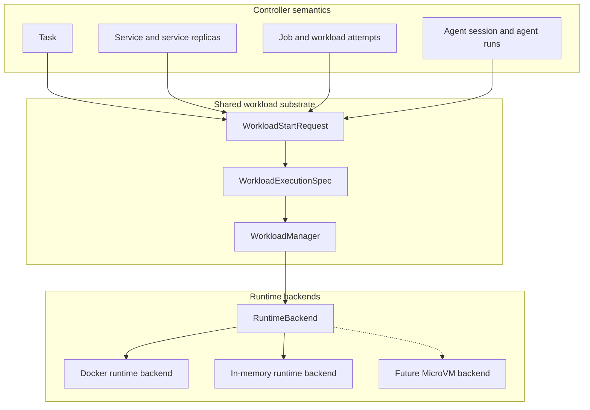
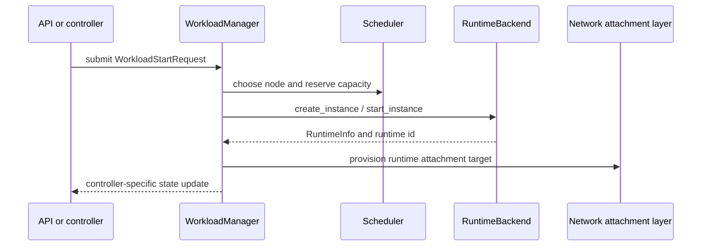
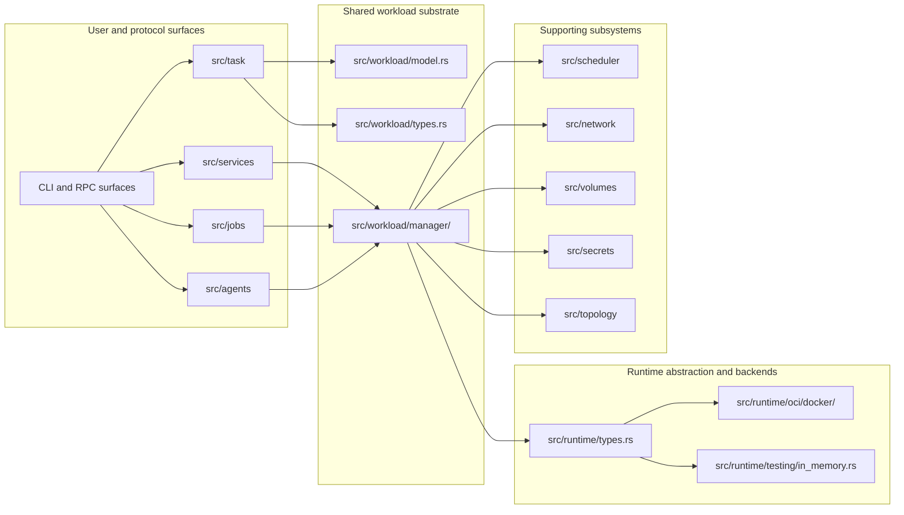

# Workloads and Runtime Substrates

Mantissa schedules *workloads*. A workload is the generic schedulable unit in
the control plane, but that does not mean every user-facing concept collapsed
into one bland type. The point of the current structure is the opposite: it
separates lifecycle semantics from execution mechanics.

A direct task, a service replica, a job attempt, and an agent run can all be
scheduled through the same workload machinery while still meaning different
things to the controllers that own them. In the same way, a workload can ask
for OCI-style execution, a sandbox contract, or a MicroVM family without
forcing the rest of the system to treat every backend like Docker.

This document explains that split from two angles. First it describes the
conceptual model: what a task, service, job, agent session, and agent run are
supposed to mean. Then it maps those concepts onto the code layout so it is
clear where the responsibilities live.

## The Mental Model

Mantissa is easiest to understand when read as three layers stacked on top of
each other.

At the top sit the controller-specific semantics. That is where the system
decides whether something is a direct task, a service that should keep a
replica set alive, a job that should run to completion with retries, or an
agent session that may pause for input and later resume.

In the middle sits the shared workload substrate. This is where the scheduler,
runtime orchestration, attachment repair, placement, and generic lifecycle
handling live. It is deliberately indifferent to whether a workload belongs to
a service rollout or to an agent controller.

At the bottom sit runtime backends. They answer the practical question of how a
workload instance is created, started, stopped, inspected, and attached to.

The important consequence is that names describe different axes:

| Term | What it answers |
| --- | --- |
| `Task`, `ServiceReplica`, `Job`, `AgentSession`, `AgentRun` | Who owns the lifecycle semantics |
| `WorkloadExecutionSpec` | How the schedulable execution should run |
| `RuntimeClass` | Which runtime family is requested |
| `RuntimeBackend` | Which local engine actually implements the request |

That is why Mantissa can talk about `WorkloadStartRequest` at the shared layer
while still exposing a first-class `tasks` user surface. The request shape is
generic; the controller that submits it gives it meaning.

## Control-Plane Concepts

The control plane contains both durable controller records and schedulable
executions. Those are not the same thing, and most confusion comes from mixing
them together.

### Task

A task is the simplest case: a standalone execution requested directly by the
operator. It has no higher-level controller trying to maintain a replica count
or apply a retry budget. If the task exits, the next action is determined by
its own execution policy and by whatever the operator does next.

Internally, a direct task is represented as a workload with
`WorkloadKind::Task`, but the task name is intentionally kept at the public
surface. The `src/task` module exists as the task-facing compatibility and API
layer over the generic workload model.

### Service and Service Replica

A service is not itself one runtime instance. A service is the durable desired
state owned by the service controller: task templates, replica counts, rollout
strategy, readiness, dependency ordering, and traffic publication rules.

When the service controller wants work to run, it materializes service-owned
replicas. Those replicas are schedulable executions and therefore go through
the shared workload layer. They are not modeled as standalone tasks because
their lifecycle is owned by the service controller rather than by an operator
submitting a single direct task.

The `ServiceReplica` workload kind is therefore about ownership semantics, not
about a different execution mechanism. A service replica may use the same
runtime family and the same execution template as a direct task, but it is
reconciled as part of a service rollout.

### Job

A job is a controller-level record for finite work. It owns retry and
completion semantics above the runtime layer. A job may launch multiple
underlying workload attempts over time, but those attempts still reuse the
shared execution substrate.

This is why a job is not simply another name for a service. A service wants to
keep a desired replica set alive and routable. A job wants to produce a
terminal success or failure. Those are different control-plane problems even if
both are implemented by creating lower-level workloads.

### Agent Session and Agent Run

Agents are deliberately split in two.

An `AgentSession` is the durable control-plane object. It owns workspace
policy, tool policy, checkpoint policy, interaction policy, queued input, and
recent structured event history. It may exist while consuming no runtime
capacity at all.

An `AgentRun` is the schedulable execution slice created from that session. It
is the thing that actually turns into an underlying workload and then into a
runtime instance. This split lets Mantissa keep an idle session durable without
pinning compute, which is important for human-in-the-loop workflows.

### Summary Table

| Object | Role in the system | Does it directly consume runtime capacity? | Primary code |
| --- | --- | --- | --- |
| Task | Standalone user-submitted execution | Yes | `src/task`, `src/workload` |
| Service | Desired state for replicated long-lived work | No | `src/services` |
| Service replica | One schedulable execution owned by a service | Yes | `src/services`, `src/workload` |
| Job | Durable finite-work controller with retries | No by itself; it launches attempts | `src/jobs` |
| Agent session | Durable agent identity, policy, and event record | No | `src/agents` |
| Agent run | One schedulable execution slice of an agent session | Yes | `src/agents`, `src/workload` |

## The Shared Execution Shape

The shared execution shape lives in `WorkloadExecutionSpec`. This type answers
the narrow question, "if something is scheduled, how should it execute?" It is
not supposed to answer higher-level questions such as "when is the rollout
healthy?" or "how many times should a failed attempt be retried?"

That boundary matters because it prevents the scheduler and runtime layer from
accumulating controller-specific policy. A service replica, a job attempt, and
an agent run can all reuse the same execution template while differing
completely in how the higher-level controller reacts to success, failure, or
missing readiness.

The execution template carries runtime-local concerns such as image, command,
TTY behavior, CPU and memory requests, GPU count, restart policy, termination
grace period, pre-stop hooks, liveness probes, environment variables, secret
files, volume mounts, and networks.

By contrast, the following policy stays above the execution layer:

| Shared execution concerns | Controller-owned concerns |
| --- | --- |
| Image and command | Service replica counts and rollout strategy |
| CPU, memory, GPU, TTY | Service readiness and dependency ordering |
| Restart policy and liveness | Job completion and retry policy |
| Volumes, networks, env, secret files | Agent workspace, tools, checkpoints, and interaction rules |

This is the key reason the code now prefers `WorkloadExecutionSpec` over
copying similar launch fields into every controller-specific type.

## Runtime Classes, Substrates, and Backends

Mantissa uses three related ideas that are easy to conflate: runtime class,
runtime backend, and sandbox profile.

A `RuntimeClass` is the cluster-visible family requested by a workload. Today
the shared model recognizes `oci`, `microvm`, and `sandbox`.

A `RuntimeBackend` is the local implementation that actually performs runtime
operations. It is responsible for create, start, stop, inspect, attach, log
streaming, exec, and event watching where supported.

A sandbox profile is an isolation profile exposed to the scheduler and the
runtime support profile. It is not the same thing as a physical substrate.

### OCI, MicroVM, and Sandbox

`oci` means container-style execution. The current production backend for that
family is Docker.

`microvm` means a MicroVM-style execution family. The model, planner, and
support profile can express it, but there is no production MicroVM backend in
the tree yet.

`sandbox` is an isolation contract, not necessarily a separate substrate. A
workload that requests the sandbox runtime class is asking for a backend that
advertises sandbox support and a compatible profile. Today that support is
advertised by the Docker backend and by the in-memory backend used for tests.
A future MicroVM backend may also advertise sandbox profiles.

That is why "sandbox" and "MicroVM" are not synonyms. A sandbox may be
implemented on top of OCI or on top of a MicroVM backend. The runtime class
expresses what the workload asks for; the backend expresses how that request is
actually fulfilled on a node.

### Capabilities and Support Profiles

Nodes advertise their runtime support with `RuntimeSupportProfile`. The profile
contains three kinds of information: which runtime classes a node supports,
which sandbox profiles it exposes, and which optional runtime features are
available.

Those feature flags matter because not every backend supports the same
interaction surface. A backend may support logs but not attach, or exec but not
lifecycle events. The workload manager therefore treats attach, exec, logs, and
lifecycle events as capabilities rather than as universal assumptions.

### Current Runtime Backend Matrix

The runtime model is broader than the set of backends currently implemented.
This table reflects what exists in the repository today.

| Backend | Status | Advertised runtime classes | Sandbox profiles | Exec | Interactive exec | Logs | Attach | Lifecycle events | Primary code |
| --- | --- | --- | --- | --- | --- | --- | --- | --- | --- |
| Docker runtime backend | Production backend | `oci`, `sandbox` | `default`, `oci-default` | Yes | Yes | Yes | Yes | Yes | `src/runtime/oci/docker/` |
| In-memory runtime backend | Test and local harness backend | `oci`, `sandbox` | `default`, `oci-default` | Yes | Yes | Yes | No | No | `src/runtime/testing/in_memory.rs` |
| MicroVM backend | Not implemented yet | None in code today | None in code today | N/A | N/A | N/A | N/A | N/A | Not present |

The important reading of this table is that support is advertised per backend,
not implied by the shared model. The presence of `RuntimeClass::MicroVm` in the
model means the scheduler and runtime APIs can express that family; it does not
mean a MicroVM engine is already wired into the runtime layer.

## Networking Is Runtime-Neutral

The networking layer no longer assumes that every schedulable execution is "a
container identified by a PID". Instead it consumes a runtime attachment target
published by the backend.

Today the shared runtime model supports three attachment target forms:

| Attachment target | Typical use |
| --- | --- |
| `NetworkNamespacePid` | OCI-style process namespace attachment |
| `NetworkNamespacePath` | Backends that expose a network namespace path directly |
| `TapDevice` | Backends that wire guest networking through a tap device, such as a MicroVM design |

This is the piece that lets containers and future MicroVM-style backends share
the same attachment orchestration without pretending they expose identical
network primitives.

## How Scheduling Fits Together

The shared workload manager is where controller-specific requests become
schedulable executions and then runtime instances.

The general flow is:

The public surface may still speak in controller-specific terms. For example,
the task API creates a workload by sending a `WorkloadStartRequest`, but it
returns a `TaskSpec` because the caller is creating a direct task. The request
shape is generic; the resulting durable record is exposed through the task
surface.

The service controller builds service-owned replica requests, the job
controller reserves and observes workload attempts, and the agent controller
creates runs from durable sessions. All of them eventually pass through the
same workload manager and runtime backend contract.

## Code Structure

The code layout follows the same conceptual split.

### `src/workload`

`src/workload/model.rs` defines the generic model and terminology: workload
kind, runtime class, workload identity, workload phases, generic state filters,
and the shared durable workload structures.

`src/workload/types.rs` defines the shared execution-side types such as
`WorkloadExecutionSpec`, restart policy, and liveness probe.

`src/workload/manager/` is the shared orchestration engine. This is where
placement, reconciliation, runtime adoption, attachment repair, local runtime
inventory handling, and task/workload start requests are implemented.

### `src/task`

`src/task` is the task-facing compatibility surface. It exists so the `tasks`
API remains a first-class operator interface while the generic orchestration
core lives in `src/workload`.

The types in `src/task/types.rs` are intentionally shallow aliases over the
generic workload model rather than a second independent task orchestration
stack.

### `src/services`

`src/services` owns service desired state, rollout progression, dependency
ordering, readiness, and traffic publication. It does not own the generic
runtime lifecycle. When it needs schedulable work to exist, it builds
service-owned replica start requests and hands them to the workload layer.

### `src/jobs`

`src/jobs` owns finite completion-oriented controller state. The job controller
tracks attempts, retry windows, and terminal success or failure. The actual
attempts still reuse the shared workload execution substrate.

### `src/agents`

`src/agents` owns durable agent sessions and runs. It is intentionally
session-oriented: sessions are durable control-plane records, while runs are
the schedulable executions that consume capacity.

The current default for agent sessions and runs is the sandbox runtime class,
which matches their need for stronger isolation and explicit interaction
policy. That default is a controller choice, not a special case in the shared
workload manager.

### `src/runtime`

`src/runtime/types.rs` defines the runtime-neutral contract: runtime create
requests, runtime info, capabilities, support profiles, runtime events, and
the `RuntimeBackend` trait itself.

`src/runtime/oci/docker/` contains the Docker-backed implementation of that
contract. The module is split by responsibility into runtime operations,
interactive attach and exec handling, image pull helpers, conversions, and
backend tests.

`src/runtime/testing/in_memory.rs` contains the in-memory backend used by the
test harness and local synthetic execution paths.

## Practical Terminology Guide

In everyday conversation inside this repository, the following shortcuts are
useful:

| If you mean... | Prefer this term |
| --- | --- |
| A standalone user-submitted execution | Task |
| The generic schedulable substrate beneath tasks, replicas, jobs, and runs | Workload |
| One service-owned schedulable execution | Service replica |
| The durable finite-work controller record | Job |
| The durable agent record that can wait for input | Agent session |
| The schedulable execution created from an agent session | Agent run |
| The family requested by the workload (`oci`, `microvm`, `sandbox`) | Runtime class |
| The local engine implementation | Runtime backend |
| A higher-level isolation request that may be implemented by OCI or MicroVM backends | Sandbox |

The model becomes much easier to reason about once those terms are kept on
their own axes. A service replica can be task-shaped in execution terms
without being a direct task. An agent run can use a sandbox runtime class
without the sandbox itself being the agent. A future MicroVM backend can
support the sandbox contract without changing the job or service controller
logic.

That separation is the main organizing principle of the current workload and
runtime design.
