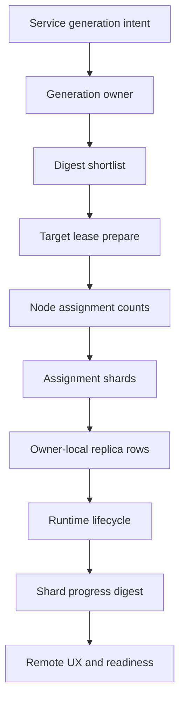
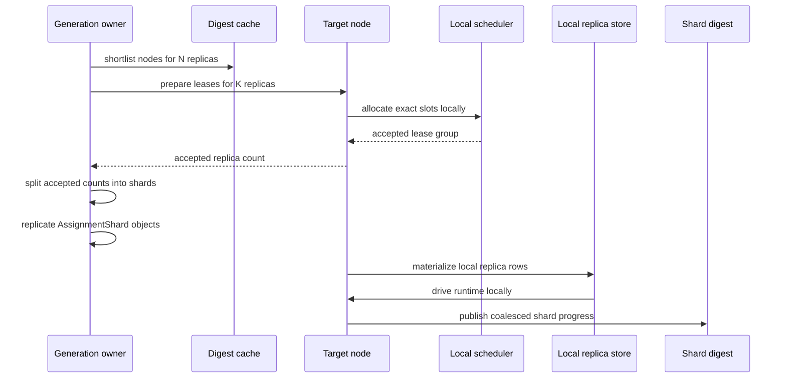

# RFC: Bulk Service Deployments and Adaptive Observability

Status: Draft

## Summary

This RFC proposes a hard scalability cutover for large service deployments.

The scheduler will continue to use one placement architecture for every size:

- shortlist from replicated scheduler digests,
- let the target node prepare leases and choose exact local resources,
- commit placement locally on the target,
- execute service generations from deterministic rollout ownership.

What changes with scale is not the scheduler logic itself, but the shape of
the replicated state and the operator UX.

For small deployments, Mantissa should preserve the current experience:

- replicate per-task lifecycle,
- allow `tasks list` from any node,
- keep `services list` and readiness task-centric.

For large deployments, Mantissa should stop treating per-task runtime
telemetry as cluster state. Instead it should replicate:

- service-generation metadata,
- placement shards,
- shard-level progress digests,
- bounded exception summaries,
- generation stop and drain completion.

This keeps one correctness path while making cluster-wide state scale with
`services + shards + nodes` rather than `tasks x lifecycle transitions`.

The proposal introduces two observability modes:

- `Detailed`: per-task replicated visibility for small deployments.
- `Sharded`: shard-based replicated visibility for large deployments.

By default, mode selection is automatic and sticky per service generation.

## Motivation

The current scheduling changes improved convergence by reducing placement
churn, but they did not remove the larger scaling wall for task count.

The remaining bottlenecks are structural:

- Each task is a replicated object.
- Each task moves through several durable lifecycle phases.
- The service generation still carries a full `task_ids` vector.
- Service readiness still watches task-level state.

The relevant current code paths are:

- replicated service spec carries all `task_ids` in
  `src/services/types.rs`,
- local launch persists `Pending` task rows and gossips them in
  `src/task/manager/local.rs`,
- task phase changes persist and gossip per task in
  `src/task/manager/state.rs`,
- readiness polls task-level lifecycle in `src/services/readiness.rs`.

That shape is acceptable for tens or hundreds of tasks. It is expensive for
thousands. It is the wrong shape for 100K.

This is also consistent with the public Nomad C1M/C2M material:

- C1M: <https://www.hashicorp.com/en/c1m>
- C2M: <https://www.hashicorp.com/en/c2m>

Their benchmark path avoided deployment and networking overhead and focused on
coarse milestones such as scheduled, received, and running. Mantissa does not
need to copy Nomad's architecture, but it should copy the lesson: large-scale
deployments cannot afford full fine-grained replicated lifecycle for every
container.

## Problem Statement

Mantissa currently pays cluster-wide cost for data that is mostly useful only
to the owning node:

- `Pending`
- `Pulling`
- `Creating`
- `Stopping`
- `Stopped`
- phase progress text
- repeated retry observations

Those fields are useful for local runtime management and debugging. They are
not useful enough to justify cluster-wide replication at 100K replicas.

If Mantissa keeps the current model, the steady-state scheduling path may
continue to improve while convergence still degrades because the cluster is
replicating too many task-row mutations.

## Goals

- Support service generations at 100K replicas without cluster-wide per-task
  lifecycle replication.
- Preserve the current remote-node UX for small deployments.
- Keep one scheduler path from 1 to 100K replicas.
- Make cluster-wide replicated state scale with shards and aggregate progress,
  not per-task phase churn.
- Keep local runtime reconciliation and local durability intact.
- Preserve failure recovery after owner restart or node failure.
- Improve stop convergence by making generation stop a compact replicated
  intent rather than a 100K remove storm.

## Non-goals

- Replacing the current digest-shortlist and target-lease scheduling model.
- Making every task globally introspectable in the same way at 100K as at 10.
- Preserving backward compatibility with the current service or task schemas.
- Benchmark-only shortcuts such as disabling readiness and networking by
  default for production deployments.

## Decision

Mantissa should use one scheduler path and two observability modes.

The scheduler path stays the same:

1. determine rollout ownership,
2. shortlist candidates from local scheduler digests,
3. prepare leases on target nodes,
4. persist accepted placement locally on those targets,
5. drive convergence from local runtime reconciliation.

The observability path becomes adaptive:

- `Detailed` mode:
  - used for small deployments,
  - replicate per-task lifecycle,
  - preserve current UX.
- `Sharded` mode:
  - used for large deployments,
  - do not replicate per-task lifecycle cluster-wide,
  - replicate shard assignments and aggregate shard progress instead.

This is a state-model split, not a scheduler split.

## Why Not Two Schedulers

We should not implement a "small deployment scheduler" and a "large
deployment scheduler".

That would duplicate correctness logic across:

- candidate selection,
- lease preparation,
- stop semantics,
- failure recovery,
- rollout ownership,
- admission and rollback.

The right abstraction boundary is:

- one placement algorithm,
- two replication and UX modes.

## Observability Modes

### Mode Selection

Each service generation chooses one observability mode at generation start.
That choice stays fixed for the lifetime of the generation.

The initial proposal is:

- manifest field:
  - `observability: auto | detailed | sharded`
- default:
  - `auto`
- automatic selection:
  - `Detailed` when total desired replicas for the generation are
    `<= 2048`,
  - `Sharded` when total desired replicas for the generation are
    `> 2048`.

This is intentionally simple for the first implementation.

Future extension:

- split `auto` into multiple ranges if we later need an intermediate
  "compact per-task" mode,
- make thresholds tunable through config.

### Detailed Mode

`Detailed` mode keeps the current behavior.

Characteristics:

- replicate task rows cluster-wide,
- replicate task phase transitions,
- keep `service.task_ids`,
- keep task-centric readiness,
- allow `tasks list --service` from any node to behave as it does now.

This mode optimizes UX.

### Sharded Mode

`Sharded` mode changes what is replicated.

Characteristics:

- do not replicate per-task lifecycle cluster-wide,
- do not store a 100K `task_ids` vector in the service spec,
- replicate assignment shards,
- replicate shard progress digests,
- replicate bounded exception summaries,
- keep owner-local task rows durable only on the owning node,
- serve detailed task inspection from the owner on demand.

This mode optimizes scale.

## Proposed Architecture

### Data Planes



Interpretation:

- Scheduling still decides placement through digests and leases.
- Large-mode replication starts after node counts are known.
- The cluster does not need every task lifecycle edge to understand
  deployment progress.

### New Replicated Objects

#### 1. Service Generation Metadata

The service generation object remains the coarse desired-state anchor, but it
changes shape in `Sharded` mode.

Add fields such as:

- `observability_mode`
- `total_desired_replicas`
- `total_assigned_replicas`
- `total_accepted_replicas`
- `total_running_replicas`
- `total_ready_replicas`
- `total_failed_replicas`
- `total_stopped_replicas`
- `assignment_shard_count`

In `Sharded` mode:

- `task_ids` must be empty,
- global progress is derived from shard digests,
- the service spec remains compact.

#### 2. Assignment Shard

Replicated object describing one compact placement decision.

Suggested shape:

- `service_id`
- `manifest_id`
- `service_epoch`
- `template_name`
- `shard_id`
- `target_node_id`
- `replica_start`
- `replica_count`
- `requested_cpu_millis`
- `requested_memory_bytes`
- `requested_gpu_count`
- `network_profile`
- `lease_group_id`
- `updated_at`
- `phase_version`
- `state`

State examples:

- `Prepared`
- `Accepted`
- `Running`
- `Stopping`
- `Stopped`
- `Failed`

Important property:

- shards are placement objects, not runtime telemetry objects.

Suggested initial default:

- `target_shard_replicas = 128`

That keeps 100K replicas at roughly 782 shards rather than 100K task rows.

#### 3. Shard Progress Digest

Replicated aggregate progress emitted by the target node.

Suggested shape:

- `service_id`
- `service_epoch`
- `template_name`
- `shard_id`
- `node_id`
- `assigned`
- `accepted`
- `running`
- `ready`
- `failed`
- `stopping`
- `stopped`
- `updated_at`
- `phase_version`

These digests are the large-deployment progress plane.

They should be:

- periodically coalesced,
- emitted on a bounded interval,
- updated by delta counts rather than individual task status gossip.

Suggested initial batching:

- flush every `250ms`, or
- earlier after `128` local lifecycle changes for the shard.

#### 4. Shard Exception Summary

Bounded replicated debug signal for failures.

Suggested shape:

- `service_id`
- `service_epoch`
- `template_name`
- `shard_id`
- `task_id`
- `node_id`
- `reason_class`
- `reason_text`
- `launch_attempt`
- `updated_at`

This is not a full failure history.

It is a bounded operator aid, for example:

- keep the last `16` unique exceptions per shard.

### New Owner-local Objects

Large-mode replicas still need local durability and runtime reconciliation.

But that durability should not imply cluster-wide replication.

Add a local-only replica store with objects like:

- `LocalReplicaSpec`
- `LocalReplicaRuntimeState`

This store must hold:

- deterministic replica identity,
- exact slot ids and gpu bindings,
- runtime phase,
- restart policy,
- local attachment state,
- last runtime observation.

This is the large-mode replacement for global per-task rows.

## Scheduling and Placement Flow

### Core Principle

The scheduler still reasons about capacity the same way.

What changes is the unit of persistence after placement:

- `Detailed`: persist per-task rows cluster-wide.
- `Sharded`: persist placement shards cluster-wide and replica rows locally.

### Bulk Placement Flow



### Replica Identity

Large-mode tasks should use deterministic replica identifiers derived from:

- `service_id`
- `service_epoch`
- `template_name`
- `global_replica_ordinal`

This removes the need to replicate a 100K task id vector.

### Lease Behavior

The existing target-side lease model still applies.

However, large-mode prepares should support bulk intent:

- reserve capacity for a count of identical replicas,
- return authoritative target acceptance,
- let the target own exact slot selection.

This is still the same architecture as today. It is simply more aggressively
batched.

## Runtime Lifecycle and Replication Rules

### Detailed Mode

Replicated cluster-wide:

- task definition,
- task lifecycle transitions,
- task stop transitions,
- task remove.

### Sharded Mode

Replicated cluster-wide:

- shard acceptance,
- shard progress digest,
- shard exception summaries,
- generation stop intent,
- shard drain completion.

Not replicated cluster-wide:

- `Pending`
- `Pulling`
- `Creating`
- `Stopping`
- `Stopped`
- phase progress text
- local retry details
- ordinary per-task remove events

Those remain owner-local.

### Key Rule

In `Sharded` mode, per-task runtime status is local telemetry, not cluster
state.

## Readiness and Rollout Behavior

### Detailed Mode

Keep the current readiness logic.

### Sharded Mode

Readiness should consume shard digests, not per-task inspection.

Deployment progress becomes:

- `assigned`
- `accepted`
- `running`
- `ready`
- `failed`

Readiness success is based on aggregate counters matching desired counts.

Failure budget is based on:

- shard failure counts,
- bounded exception summaries,
- optional per-template failure thresholds.

This avoids scanning 100K task rows to decide whether a generation is healthy.

## Stop Semantics

Stop should not be a 100K replicated delete storm in `Sharded` mode.

Instead:

1. the service generation publishes terminal stop intent,
2. each target node drains local replicas for the assigned shards,
3. each target publishes shard drain completion in its progress digest,
4. once every shard reaches zero active replicas, the generation is stopped.

Detailed per-task stop state remains local.

## Remote UX

### Small Deployment UX

For small deployments, the operator experience should remain the same.

From any node:

- `mantissa services list` shows current deployment status,
- `mantissa tasks list --service demo` shows each task,
- `mantissa tasks inspect <id>` behaves normally.

Example:

```text
SERVICE  STATUS     READY  RUNNING  MODE
demo     Deploying  6/10   8/10     detailed
```

```text
TASK                                    STATE
demo-stress-backend-0-...               pulling
demo-stress-backend-1-...               creating
demo-stress-backend-2-...               running
...
```

### Large Deployment UX

For large deployments, remote UX should be aggregate-first.

From any node:

- `mantissa services list` shows generation counters and mode,
- `mantissa services progress <service>` streams shard aggregate progress,
- `mantissa tasks list --service demo` shows a summary by default,
- `mantissa tasks list --service demo --sample 50` returns a sampled view,
- `mantissa tasks inspect <id>` proxies to the owner node on demand when
  possible.

Example:

```text
SERVICE  STATUS     ASSIGNED   ACCEPTED   RUNNING   READY   FAILED  MODE
demo     Deploying  100000     100000     82311     79020   12      sharded
```

Example default `tasks list` behavior:

```text
service 'demo' uses sharded observability
showing aggregate progress instead of every replica row

template=stress-backend  desired=100000  shards=782
running=82311  ready=79020  failed=12

use:
  mantissa services progress demo
  mantissa tasks list --service demo --sample 50
  mantissa tasks inspect <task-id>
```

This preserves good UX for 10 tasks without pretending 100K per-task rows are
useful table output.

## Metrics and Stress Visibility

We should add metrics that explicitly measure churn reduction.

### New Metrics

- `task_phase_persist_total`
- `task_phase_gossip_total`
- `task_remove_gossip_total`
- `service_generation_mode_total{mode}`
- `assignment_shard_count`
- `assignment_shard_rebalance_total`
- `shard_progress_flush_total`
- `shard_progress_rows_total`
- `shard_exception_rows_total`
- `local_replica_rows_total`
- `owner_proxy_task_inspect_total`
- `generation_assigned_to_ready_seconds`
- `generation_stop_to_zero_seconds`

### Stress Test Output

Extend stress output with:

- selected observability mode,
- shard count,
- task-row writes during deployment,
- shard progress updates during deployment,
- exception count,
- generation assigned-to-ready time,
- generation stop-to-zero time.

The current task-root settle metric should remain, but it is not enough on its
own once the system stops replicating per-task rows for large generations.

## Configuration

Add the following initial configuration knobs:

- `service_observability_auto_threshold_replicas = 2048`
- `service_target_shard_replicas = 128`
- `service_shard_progress_flush_ms = 250`
- `service_shard_progress_flush_transitions = 128`
- `service_shard_exception_limit = 16`

Manifest-level override:

- `observability: auto | detailed | sharded`

The threshold should apply to total desired replicas across the whole service
generation, not per template.

## Contract Changes

This proposal requires schema changes.

### Service Schema

Update `services.capnp` and service wire codecs to add:

- `observabilityMode`
- generation aggregate counters
- shard references or shard-count metadata
- optional removal of `taskIds` in `Sharded` mode

### New Shard Schemas

Add new replicated domains and schemas for:

- `service_assignment_shard`
- `service_shard_progress`
- `service_shard_exception`

### Task Schema

Detailed-mode task schema can remain.

For `Sharded` mode:

- remote CLI detail should use owner-proxied task inspection,
- cluster-wide task schema should no longer be the source of readiness or
  progress.

## Implementation Plan

### Phase 0: Instrumentation and Mode Selection

Goal:

- choose the per-generation observability mode,
- emit churn metrics,
- do not change behavior yet.

Files:

- `src/services/types.rs`
- `src/services/service.rs`
- `crates/protocol/schema/services.capnp`
- `crates/client/src/services/list.rs`
- `tests/stress_large_cluster.rs`

### Phase 1: Service UX Separation

Goal:

- keep current small-deployment UX,
- introduce aggregate-first UX for large mode,
- leave scheduling behavior unchanged.

Files:

- `crates/client/src/services/list.rs`
- `crates/client/src/tasks/list.rs`
- new `services progress` client/server RPC
- `src/task/service.rs`
- `src/services/manager.rs`

### Phase 2: Shard Stores and Schemas

Goal:

- add replicated shard placement and shard progress domains,
- keep current task store for detailed mode only.

Files:

- new:
  - `src/services/shards.rs`
  - `src/services/progress.rs`
  - `src/store/service_assignment_shard_store.rs`
  - `src/store/service_shard_progress_store.rs`
  - `src/store/service_shard_exception_store.rs`
- update:
  - `src/gossip/mod.rs`
  - `src/sync/mod.rs`
  - `src/sync/delta.rs`
  - `src/server/bootstrap.rs`
  - `src/topology/mod.rs`

### Phase 3: Bulk Placement by Shard

Goal:

- keep the existing digest-and-lease scheduling model,
- emit node allocation counts and shards instead of cluster-wide per-task rows
  in large mode.

Files:

- `src/task/manager/planner.rs`
- `src/task/manager/reservation.rs`
- `src/services/manager.rs`
- `src/services/rollout.rs`
- `src/scheduler/mod.rs`
- `src/scheduler/service.rs`
- `crates/protocol/schema/scheduling.capnp`

### Phase 4: Owner-local Replica Store

Goal:

- persist sharded-mode replicas durably on the owner only,
- run runtime reconciliation without cluster-wide task replication.

Files:

- new:
  - `src/task/local_replica_store.rs`
  - `src/task/local_replica_types.rs`
- update:
  - `src/task/manager/local.rs`
  - `src/task/manager/state.rs`
  - `src/task/manager/runtime.rs`
  - `src/task/manager/mod.rs`

### Phase 5: Shard-based Readiness and Stop

Goal:

- remove large-mode dependence on per-task inspection,
- converge stop and readiness from shard digests.

Files:

- `src/services/readiness.rs`
- `src/services/manager.rs`
- `src/services/slot_reconcile.rs`
- `tests/services.rs`
- `tests/stress_large_cluster.rs`

### Phase 6: Owner-proxied Task Detail

Goal:

- preserve debuggability for large deployments without replicating every task.

Files:

- `src/task/service.rs`
- `crates/client/src/tasks/list.rs`
- `crates/client/src/tasks/inspect.rs` or equivalent

## Acceptance Criteria

Functional:

- deployments at 10 tasks retain current remote-node UX,
- deployments above the threshold use aggregate shard progress,
- large-mode readiness does not scan per-task cluster state,
- large-mode stop converges without per-task global remove chatter.

Performance:

- cluster-wide replicated row count for a 100K deployment is proportional to
  shard count, not task count,
- convergence metrics improve as task count increases,
- task-root churn is no longer the primary convergence cost for large mode.

Operational:

- owner restart reconstructs local replicas from shard assignments,
- node failure causes shard reassignment without requiring global per-task
  status replay,
- remote operators can still inspect failures through shard exceptions and
  owner-proxied detail.

## Alternatives Considered

### 1. Keep Current Replicated Task Model and Just Batch More

Rejected.

This may improve throughput somewhat, but it does not remove:

- per-task replicated rows,
- per-task lifecycle churn,
- 100K `task_ids` vectors,
- task-centric readiness scans.

### 2. One Fully Sharded Model for Every Deployment

Rejected for the initial cut.

It would simplify the implementation eventually, but it would noticeably
degrade the UX for small deployments where rich per-task visibility is useful
and cheap.

### 3. Two Different Schedulers

Rejected.

The scheduler path should remain unified. The state and UX paths should adapt.

## Open Questions

- Should `Sharded` mode become the default at a lower threshold than 2048?
- Do we need an intermediate `Compact` mode later, or are `Detailed` and
  `Sharded` enough?
- Should the owner-local replica store be separate from the existing task store,
  or should the current task store learn a non-replicated scope?
- How much per-task detail should owner-proxied remote inspection expose for a
  100K deployment by default?
- Should benchmark-oriented profiles explicitly disable readiness and traffic
  publication, similar to Nomad's public C1M/C2M setup?

## Recommendation

Implement this RFC in the following order:

1. mode selection and metrics,
2. aggregate UX for large mode,
3. replicated shard objects,
4. owner-local replica durability,
5. shard-based readiness and stop.

The key decision is this:

Mantissa should not try to make 100K deployments look like 10-task deployments
internally. It should keep one scheduler path and change the replicated state
model so large-scale progress is represented by shards and aggregate digests,
not by a storm of per-task lifecycle rows.
